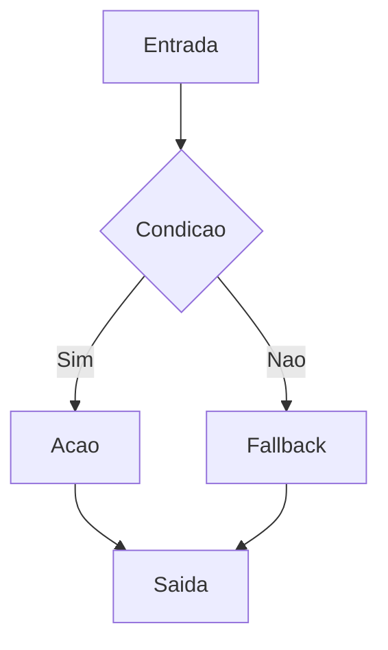
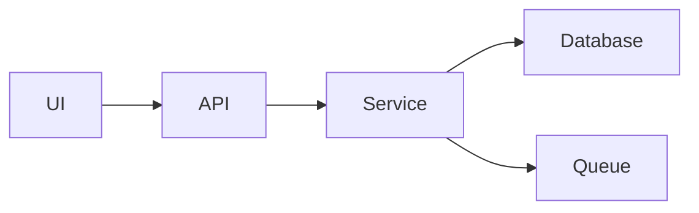
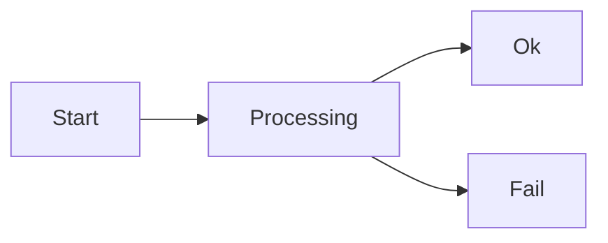

# [Titulo do Assunto]

> **Objetivo deste template**
> Criar documentacao que funcione como **treinamento** para dev senior e especialista: teoria suficiente para formar criterio, exemplos concretos, e detalhamento de operacao (falhas, observabilidade, seguranca, trade-offs).

---

## Objetivos de Aprendizado (para senior)

Ao final, a pessoa deve conseguir:

- Explicar o tema e **por que** ele existe (problema e contexto).
- Aplicar o tema com **invariantes** claros e contratos explicitados.
- Identificar **falhas reais** e desenhar resiliencia.
- Fazer review tecnico usando checklists (arquitetura, seguranca, operacao).
- Implementar uma versao minima com exemplos (codigo, schema, queries).

---

## Contexto, Escopo e Nao-Objetivos

- **Quando usar** (sinais de necessidade, escala, risco, criticidade).
- **Quando nao usar** (complexidade desnecessaria, alternativas mais simples).
- **Assumptions** (modelo de consistencia, dominio, constraints).
- **Nao-objetivos** (o que fica fora para nao virar um texto infinito).

---

## Glossario (padronize linguagem)

| Termo | Definicao curta | Observacao pratica |
|------|------------------|--------------------|
| [Termo] | [Definicao] | [Como aparece em incidentes/producao] |

---

## Modelo Mental (intuicao + formalizacao)

Explique primeiro com intuicao, depois com rigor:

- **Metafora curta** (1 paragrafo)
- **Modelo formal** (entidades, estados, transicoes, contratos)
- **Invariantes** (o que nao pode ser violado)

---

## Fundamentos Teoricos e Evolucao

### Teoria essencial

- Definicoes formais (se existirem): consistencia, atomicidade, idempotencia, causalidade, etc.
- Propriedades desejadas e limites: latencia, disponibilidade, consistencia, custo.
- Onde a teoria costuma ser mal interpretada (pegadinhas de senior).

### Evolucao e padroes de mercado

- Por que o mercado convergiu para certos padroes.
- Variantes comuns e quando cada uma faz sentido.

---

## Diagramas e Intuicao Visual (quando pertinente)

Inclua diagramas e/ou graficos sempre que eles ajudarem a **reduzir ambiguidade** e acelerar a compreensao.

Use especialmente quando houver:

- **Fluxos** (request lifecycle, pipelines, estados e transicoes)
- **Estruturas** (componentes, camadas, dependencias)
- **Algoritmos** (passo a passo, invariantes, decisoes)
- **Trade-offs** (custo vs latencia, throughput vs consistencia)

### Mermaid (modo compatibilidade GitHub)

Para funcionar bem no GitHub, use um subconjunto mais conservador do Mermaid:

- Prefira `graph` (ex.: `graph LR`, `graph TD`) em vez de sintaxes mais novas.
- Escreva labels **simples e curtas**, de preferencia em ASCII:
  - Evite acentos dentro do Mermaid (use `Nao`, `Operacao`, `Padrao`).
  - Evite parenteses `()`, ponto de interrogacao `?`, barra `/`, colchetes `[]` em textos.
  - Evite `>` em labels (use `maior que`).
- Para texto na aresta, use `A -- texto --> B` (evite `A -->|texto| B`).

#### Exemplo: fluxo/decisao



#### Exemplo: componentes/dependencias



#### Exemplo: state machine (minimo)



### Dica pratica

- Se um diagrama quebrar no GitHub, simplifique textos do Mermaid (labels menores, sem caracteres especiais).

---

## Arquitetura de Referencia (como isso vive em sistemas reais)

Descreva uma arquitetura de referencia com:

- Componentes (servicos, filas, storage)
- Fluxos sincronos e assincronos
- Fonte de verdade (source of truth)
- Derivacoes (projecoes, caches, indices)

Inclua no minimo um diagrama de componentes e um de fluxo (quando aplicavel).

---

## Modelo de Dados e Contratos

### Entidades e eventos

- Entidades principais e seus ids estaveis
- Eventos/commands (se aplicavel): nomes, payloads, chaves de dedup

### Schema (exemplo minimo)

Inclua exemplos reais (ajuste ao tema):

- SQL para tabelas criticas e indices
- Estruturas de mensagens (JSON) e contratos
- Regras de validacao e constraints

---

## Algoritmos, Fluxos Criticos e Invariantes

### Invariantes (obrigatorio para temas criticos)

Liste invariantes como sentencas verificaveis:

- "Nunca existira mais de um [efeito] para o mesmo [id]"
- "A soma de [X] deve ser igual a [Y]"
- "Transicoes validas: [A] -> [B], [B] -> [C]"

### Pseudocodigo / codigo minimo

Inclua pelo menos um exemplo executavel ou quase executavel:

```text
handle(command):
  validate
  dedup
  persist effect
  publish event
```

Explique:

- Pre-condicoes e post-condicoes
- Concorrencia (locks, otimismo, filas)
- Como evitar efeitos duplicados

---

## Falhas, Resiliencia e Recuperacao

Mapeie falhas reais e como o sistema se comporta:

- Timeouts e resultados desconhecidos
- Retries e idempotencia (producer e consumer)
- Duplicidade e fora de ordem
- Particoes de rede e consistencia eventual
- Backpressure e overload

Inclua:

- Estado "unknown" (quando aplicavel) e reconciliacao
- Estrategia de retry (limites, jitter, circuit breaker)
- Estrategia de replay e reprocessamento

---

## Observabilidade e Operacao (production ready)

### Logs, metricas e traces

- Chaves obrigatorias em log (ids, correlation ids)
- Metricas de negocio e sistema (taxas, lag, latencia)
- Tracing ponta a ponta e propagacao de contexto

### Como documentar metricas (sem frases curtas)

Quando o texto falar de metricas (ex.: p95, p99, taxa de erro, lag), **nao** escreva apenas definicoes de 1 frase. Trate como livro de treinamento:

- **O que eh** (definicao, unidade, tipo)
- **Por que importa** (qual decisao operacional ela suporta)
- **Como medir** (onde instrumentar, cardinalidade, agregacao)
- **Como interpretar** (sinais de overload, contencao, regressao)
- **Armadilhas** (media escondendo cauda, counters resetando, cardinalidade alta)

Use esta ficha por metrica:

| Campo | Preencha |
|------|----------|
| Nome | [ex.: request_latency_seconds] |
| Tipo | Counter / Gauge / Histogram |
| Unidade | ms / s / bytes / items |
| Labels | [endpoint, result, dependency] (evitar alta cardinalidade) |
| O que eh | [definicao] |
| Por que importa | [impacto em SLO, corretude, custo] |
| Interpretacao | [o que significa subir/descer] |
| Alertas | [limites e janelas] |
| Armadilhas | [ex.: media, p99, resets] |

#### Percentis (p95, p99) como explicar

Explique sempre:

- Percentil eh um resumo de distribuicao: `p99` significa que 99% das amostras ficaram abaixo daquele valor.
- Por que **cauda** importa em concorrencia (fila/lock afeta poucos, mas derruba p99).
- Por que media nao basta (media esconde outliers).
- Como medir corretamente (histogramas / tooling equivalente) e qual unidade.

### Alertas e SLOs

- SLI/SLOs propostos (latencia, erro, backlog)
- Alertas acionaveis (com playbook)

---

## Seguranca, Privacidade e Compliance

Inclua o minimo:

- Threat model (abuso, fraude, escalacao, replay)
- Protecao de dados (PII, secrets, criptografia em repouso e em transito)
- Autorizacao/autenticacao e auditoria

---

## Performance, Capacidade e Custos

- Caminho critico e gargalos
- Limites (rate limits, tamanho de payload, cardinalidade)
- Custos dominantes (compute, storage, rede)
- Estrategias de cache e invalidacao (quando aplicavel)

---

## Testabilidade (como provar que esta correto)

Descreva uma estrategia em camadas:

- Unit (invariantes e funcoes puras)
- Integration (storage, filas, provedores)
- Contract (eventos/APIs)
- E2E (fluxo principal)

Para sistemas criticos, inclua:

- Testes de idempotencia e duplicidade
- Testes de concorrencia
- Testes de resiliencia (fault injection / chaos)

---

## Trade-offs, Alternativas e Decisoes (ADR-lite)

Documente escolhas como se fosse um review:

- Opcoes consideradas
- Por que escolhemos X e nao Y
- Consequencias e riscos
- O que monitorar em producao para validar a escolha

Uma tabela ajuda:

| Opcao | Prós | Contras | Quando usar |
|------|------|---------|-------------|
| [X] | [ ] | [ ] | [ ] |

---

## Checklist de Review (para usar em PR e design review)

- Invariantes estao explicitados e testados
- Contratos e schemas versionados e validados
- Idempotencia definida (producer e consumer)
- Observabilidade suficiente (logs/metricas/traces)
- Playbooks para falhas comuns
- Seguranca: autenticacao/autorizacao e protecao de dados

---

## Estudos de Caso e Exercicios

Inclua exercicios para fixar o conhecimento:

- "Projete X sob constraint Y"
- "Qual estrategia de retry para este fluxo?"
- "Como reconciliar quando ha estado desconhecido?"
- "Quais metricas voce colocaria no dashboard?"

---

## Referencias (alta qualidade)

Prefira:

- Documentacao oficial (protocolos, RFCs, cloud providers)
- Papers e posts tecnicos com detalhes
- Talks tecnicas com conteudo pratico
- Livros de base (arquitetura, distribuicao, observabilidade)
