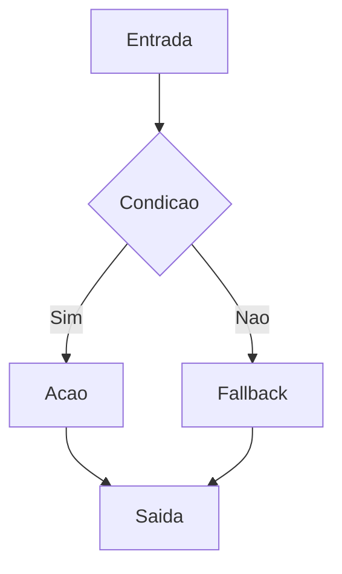
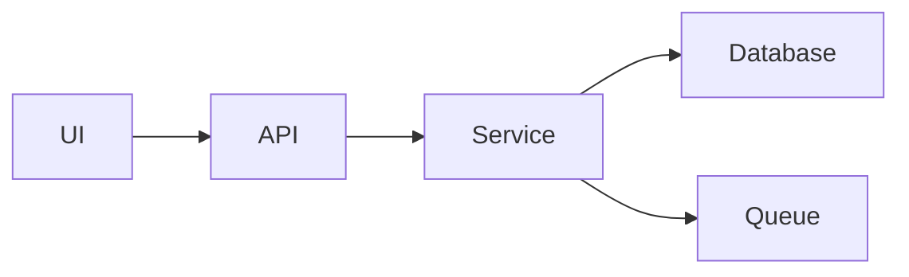
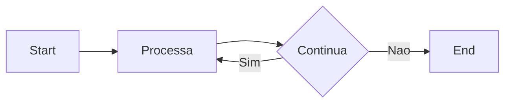

# [Título do Assunto]

## Visão Geral e Contexto de Mercado

Explique o conceito com profundidade, coloque-o no contexto de ciclo de vida de software moderno (empresas, squads ágeis, microserviços, DevOps).  
_Exemplo: A abordagem TDD, quando bem aplicada em sistemas críticos com pipelines CI/CD, reduz drasticamente retrabalho e acelera feedback loops em squads de produto._

---

## Fundamentos, Evolução e Padrões de Mercado

- **Histórico e Evolução do Tema**  
  Ex: "Testes evoluíram de estratégias manuais a automação complexa integrada aos deployments."

- **Padrões e Protocolos Usados no Mercado**
  - Normas (ex: ISO/IEC para testes)
  - Design Patterns recorrentes
  - Metodologias aceitas (ex: ATDD, BDD dentro de pipelines DevOps)

---

## Diagramas e Intuição Visual (quando pertinente)

Inclua diagramas e/ou gráficos sempre que eles ajudarem a **reduzir ambiguidade** e acelerar a compreensão.

Use especialmente quando houver:

- **Fluxos** (pipeline, request lifecycle, CI/CD, estados e transições)
- **Estruturas** (componentes, camadas, dependências, árvores, grafos)
- **Algoritmos** (passo a passo, invariantes, decisões)
- **Trade-offs** (custo vs latência, throughput vs consistência)

### Mermaid (modo compatibilidade GitHub)

Para funcionar bem no GitHub, use um subconjunto mais conservador do Mermaid:

- Prefira `graph` (ex.: `graph LR`, `graph TD`) em vez de sintaxes mais “novas”.
- Escreva labels **simples e curtas**, de preferência em ASCII:
  - Evite acentos dentro do Mermaid (use `Nao`, `Operacao`, `Padrao`).
  - Evite parênteses `()`, ponto de interrogação `?`, barra `/`, colchetes `[]` dentro de textos.
  - Evite `>` dentro de labels (use `maior que`).
- Para texto na aresta, use `A -- texto --> B` (evite `A -->|texto| B`).

#### Exemplo 1: Fluxo/decisao



#### Exemplo 2: Componentes/dependencias



#### Exemplo 3: Algoritmo (loop)



### Dica pratica

- Se um diagrama quebrar no GitHub, simplifique os textos do Mermaid (labels menores, sem caracteres especiais) antes de tentar recursos mais complexos.

---

## Principais Desafios no Uso Profissional

- **Escalabilidade dos Testes/Padrões**  
  Como o tema se comporta em sistemas grandes e distribuídos.
- **Performance e Manutenção**  
  Ex: "Execução lenta de testes pode travar pipelines; técnicas de paralelização e testes focados são mandatórias."
- **Gerenciamento Técnico (Debt, Coverage, Flakiness)**  
  Como resolver e monitorar.

---

## Estratégias Avançadas e Decisões Arquiteturais

- **Integração com CI/CD**
- **Práticas de mercado: Pirâmide de Testes, Testes em múltiplos ambientes, mocks de infraestrutura**
- **Métrica de Qualidade**  
  - Code Coverage realista (quanto cobre, quanto importa — branch, mutation)
  - Flaky test detection, ficha de manutenção
  - Linters com testes e padrões

---

## Exemplos Avançados (Python, C# e Go)

### Python
```python
import pytest
from unittest.mock import patch

@pytest.mark.parametrize('input, esperado', [(3, "Fizz"), (5, "Buzz"), (15, "FizzBuzz")])
def test_fizzbuzz(input, esperado):
    assert fizzbuzz(input) == esperado

def test_integração_bd(monkeypatch):
    with monkeypatch.context() as m:
        m.setattr('modulo.db.conectar', lambda: MockDB())
        assert executar_consulta() == 'ok'
```
- Testando side effects, integrações, mocks de sistemas externos, paralelização via pytest-xdist.

### C#
```csharp
using Moq;
using Xunit;

public class PaymentTests {
    [Fact]
    public void ProcessPayment_WhenDBFails_ShouldRollback() {
        var repo = new Mock<IPaymentRepository>();
        repo.Setup(x => x.Save()).Throws(new Exception());

        var service = new PaymentService(repo.Object);

        Assert.Throws<Exception>(() => service.ProcessPayment());
        // assert efeito colateral, ex: logs, mensagem para Sentry
    }
}
```
- Uso de Mock, asserts avançados, integração com logs/docs de incidentes.

### Go
```go
func TestHandler_Parallel_Integration(t *testing.T) {
    t.Parallel()
    server := httptest.NewServer(...)
    defer server.Close()
    res, err := http.Get(server.URL + "/health")
    require.NoError(t, err)
    require.Equal(t, 200, res.StatusCode)
}
```
- Testes paralelos, integração em endpoints, uso de require/helpers para evitar flaky tests.

---

## Boas Práticas Sêniores e Armadilhas

- **Testes determinísticos, rápidos, repeatable.**
- Como lidar com testes legados sem confiabilidade.
- Limite de coverage como métrica, armadilha de 100%.
- Testes como documentação viva e base para onboarding.
- Automatize tudo: hooks em PR, código bloqueando deploy sem cobertura mínima.
- Testes para incidentes: como criar cenários de falha realistas.
- Evitar overdesign: escolha patterns conforme contexto, não por modismo.

---

## Integração na Arquitetura Real

- **Orquestração com Docker/Kubernetes:** Testes de contract e integração em ambientes orquestrados.
- **Pipelines CI/CD:** Exemplo de configuração ideal, hooks para pass/fail, métricas exportadas (Prometheus, Datadog).
- **Integração com ferramentas de QA, análise estática, monitoramento pós-deploy.**
- **Testes e Infra-as-Code:** Estratégias para garantir testes de recursos AWS/Azure/GCP.

---

## Métricas, Monitoramento e Melhoria Contínua

- Cobertura, tempo de execução, flaky rate, incidentes reais pegos em produção vs. cobertura.
- Gersção de relatórios automáticos.
- Acompanhamento com dashboards reais.
- Estratégias para cultura de melhoria (CoP, guildas técnicas).

---

## Frameworks e Ferramentas do Mercado

- **Python:** pytest, pytest-cov, FactoryBoy, behave, tox, coverage.py, allure
- **C#:** xUnit, Xunit.Gherkin.Quick, Moq, SpecFlow, NCrunch, Coverlet, SonarQube
- **Go:** GoConvey, Testify, ginkgo/gomega, GoMock, Codecov.io
- **Ferramentas de integração:** GitHub Actions, Azure DevOps, Jenkins, CircleCI, SonarCloud

---

## Recursos Avançados e Leituras Recomendadas

- Artigos, talks de conferências, repositórios exemplares de grandes empresas (Netflix, Uber, Nubank)
- Casos de uso reais (papers, blogs, incident reviews)
- Livros: _Building Microservices (Sam Newman)_, _Clean Architecture (Robert C. Martin)_, _The Pragmatic Programmer_, _Distributed Systems Observability_

---

## FAQ Especialista

**Como evitar “testes que só testam mocks”?**  
Dê exemplos práticos de integração real. Use contract testing (ex: Pact no Go, Python).

**Testes em sistemas legacy altamente acoplados?**  
Apresente estratégia em “faixas”: characterization tests, refatoração incremental, prioridade por risco.

**Como vender a importância do investimento em testes avançados dentro da empresa?**  
Use argumentos de custo de incidentes, velocidade de deploy e retenção de talento técnico.

---

## Referências e Práticas do Mercado

- _Catálogo de Testes do ThoughtWorks Tech Radar_
- _Exemplos aprofundados em repositórios de empresas líderes_
- _Guias de qualidade de software da Martin Fowler, Kent Beck, Google Testing Blog_
