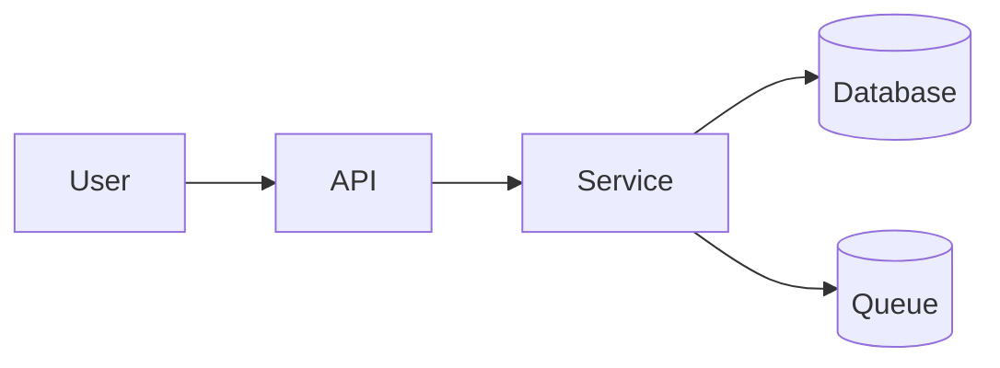

[Anterior](quality-attributes-and-trade-offs.md) | [Índice](../../SUMMARY.md) | [Próximo](modular-monolith.md)

# C4 Model & Diagramas — Comunicação de Arquitetura que Funciona

## Visão Geral e Contexto de Mercado

Arquitetura não vive só no código: vive em decisões e comunicação. O C4 Model (Context, Container, Component, Code) é usado em empresas para reduzir ambiguidade e acelerar alinhamento entre engenharia, produto e operações.

O ganho de carreira aqui é direto: quem consegue **desenhar o sistema com clareza** geralmente lidera decisões e destrava squads.

---

## Fundamentos, Evolução e Padrões de Mercado

- **Níveis do C4**
  - **Context:** quem usa, quais sistemas integram.
  - **Container:** principais aplicativos/serviços e stores.
  - **Component:** módulos internos e responsabilidades.
  - **Code:** detalhe (nem sempre necessário no doc).

- **Padrões de mercado**
  - Diagramas versionados no repositório (PR atualiza diagrama junto do change).
  - Diagramas orientados a *use case* (mostra fluxo crítico).

---

## Principais Desafios no Uso Profissional

- **Diagrama como “arte”**: bonito, mas não ajuda decisão.
- **Sem escopo**: tenta explicar tudo e vira ilegível.
- **Não acompanha mudanças**: desatualiza e perde confiança.

---

## Estratégias Avançadas e Decisões Arquiteturais

- **Regra de ouro**: diagrama serve a uma pergunta.
  - “Como autenticação funciona ponta a ponta?”
  - “Qual é o caminho do dinheiro/evento?”

- **Diagrama mínimo útil**
  - 1 diagrama de contexto.
  - 1 diagrama de containers.
  - 1 diagrama de fluxo crítico (com falhas).

---

## Exemplo (Mermaid — container/fluxo mínimo)

---

## Referências e Práticas do Mercado

- Simon Brown — C4 Model
- Runbooks e diagramas de fluxo para operações críticas
- OpenTelemetry para correlacionar diagrama com traces
