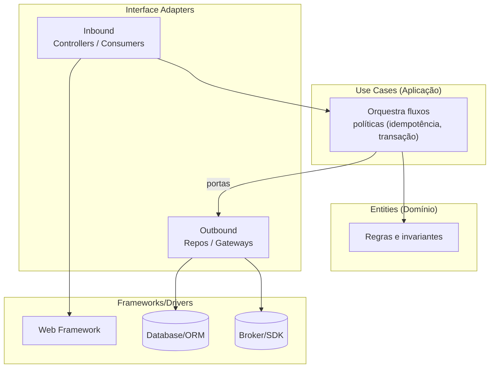

[Anterior](onion-architecture.md) | [Índice](../../SUMMARY.md) | [Próximo](quality-attributes-and-trade-offs.md)

# Clean Architecture — Comparativo e Implementação Prática

## Objetivos de Aprendizado (para leigos e iniciantes)

Ao terminar este capítulo, você consegue:

- Explicar a Clean Architecture como “Onion com papéis mais explícitos”.
- Nomear cada camada e dizer o que pode (e não pode) depender dela.
- Construir um fluxo simples de ponta a ponta sem deixar o framework contaminar o core.
- Reconhecer quando a Clean está virando burocracia e como simplificar.

---

## A Ideia em Uma Frase

**Regra de dependência:** código de alto nível (regras do negócio) não depende de baixo nível (framework, banco, SDK). A direção das dependências é sempre para dentro.

---

## Modelo Mental (camadas e “adaptadores”)

Pense em quatro grupos:

- **Entities (Domínio):** regras do negócio mais duráveis.
- **Use Cases (Aplicação):** como o negócio acontece (orquestração).
- **Interface Adapters:** tradução de formatos (HTTP/JSON ↔ domínio; DB ↔ domínio).
- **Frameworks/Drivers:** detalhes (ORM, web framework, broker, SDKs).

Na prática, o ponto forte da Clean é explicar bem a camada de **interface adapters**: ela existe para proteger o core de formatos e detalhes (ex.: request HTTP, schemas do ORM).

---

## Glossário Essencial

| Termo | Significa | Exemplo |
|---|---|---|
| Entity | Regra de negócio “pura” | `Customer`, `Order` |
| Use Case | Ação do negócio | `RegisterCustomer`, `PlaceOrder` |
| Adapter | Traduz e integra | Controller HTTP, Repo SQL |
| DTO | Objeto de transporte | `RegisterCustomerRequest` |
| Boundary | Fronteira entre camadas | Interface de entrada/saída |
| Composition Root | Onde liga as dependências | `main`, container DI |

---

## Diagrama (visão simples)



---

## Visão Geral e Contexto de Mercado

## Visão Geral e Contexto de Mercado

Clean Architecture (popularizada por Robert C. Martin) é uma forma pragmática de organizar sistemas para manter o **core do negócio** independente de frameworks, UI, banco e integrações. Em empresas, ela aparece como:

- Base para monólitos “bem estruturados” e para serviços em arquitetura orientada a eventos.
- Linguagem comum em entrevistas (principalmente para níveis sênior) para discutir **dependências**, **testabilidade** e **trade-offs**.

A regra mais importante é a mesma que você já viu em Onion/Hexagonal:

- Dependências (imports/compilação) apontam para dentro: **Entities → Use Cases → Interface Adapters → Frameworks/Drivers**.

---

## Fundamentos, Evolução e Padrões de Mercado

- **O que muda vs Onion/Hexagonal**
  - Clean descreve “anéis” semelhantes à Onion, mas explicita melhor a função de *interface adapters*.
  - Na prática, os três estilos convergem: o que importa é a **regra de dependência** e fronteiras claras.

- **Camadas típicas (interpretação prática)**
  - **Domain/Entities:** regras e invariantes “puras”.
  - **Application/Use Cases:** orquestra fluxos, transações, políticas, idempotência.
  - **Adapters (inbound/outbound):** HTTP controllers, consumers, repos, gateways.
  - **Infra:** framework web, ORM, clients, SDKs, detalhes.

---

## Principais Desafios no Uso Profissional

- **Cerimônia e excesso de abstração**: interfaces demais, DTOs demais, pouca clareza.
- **Fronteiras falsas**: pastas bonitas, mas o domínio importando ORM/HTTP.
- **Mapeamento e duplicação**: DTO ↔ domínio ↔ persistência (custo real de manutenção).
- **“Clean” sem produto**: arquitetura perfeita que não entrega valor e atrasa feedback.

---

## Estratégias Avançadas e Decisões Arquiteturais

- **Comece por casos de uso e invariantes**
  - Defina o que é “efeito” (persistência, publish, chamada externa) e onde isso acontece.
  - Garanta que o core seja testável sem infraestrutura.

- **Defina contratos nas bordas**
  - Inbound: OpenAPI/Protobuf/AsyncAPI.
  - Outbound: ports com *shape* do domínio (não do SDK).

- **Testes que sustentam a arquitetura**
  - Unit tests para domínio/casos de uso.
  - Integration tests para adapters (DB, broker, HTTP) com ambientes efêmeros.
  - E2E só para fluxos críticos.

---

## Como Aplicar (passo a passo)

1. Escreva 3–10 casos de uso como frases: “Cadastrar cliente”, “Criar pedido”, “Cancelar assinatura”.
2. Para cada caso de uso, separe:
  - Regras (core) vs efeitos/IO (fora)
3. Modele o domínio com o mínimo de tipos/entidades necessários.
4. Desenhe as portas de saída: repositório, gateway de pagamento, publicador de eventos.
5. Crie adaptadores de entrada (HTTP/consumer) que só traduzem e chamam o use case.
6. Faça o composition root montar tudo.
7. Cubra com testes: unit no core, integração na infra.

---

## Exemplo Guiado (mini fluxo de ponta a ponta)

Vamos imaginar o caso de uso: **Cadastrar Cliente**.

- Entrada (inbound): HTTP `POST /customers`
- Use case: valida e garante unicidade
- Saída (outbound): salva no repositório

### Estrutura mínima (genérica)

Estrutura comum (exemplo genérico):

```text
src/
  domain/
  application/
  adapters/
    inbound/
    outbound/
  infra/
```

Heurística de review rápida:

- Domínio importa apenas linguagem padrão (sem infra).
- Use cases dependem de ports/interfaces.
- Infra implementa ports e é montada no composition root.

### Checklist rápido (review)

- O domínio não importa web/ORM/SDK.
- O caso de uso não conhece JSON nem SQL.
- Adaptadores fazem tradução (DTO ↔ domínio) e não carregam regra.
- O composition root é o único lugar com “new”/injeção geral.

---

## Exercícios (para fixar)

1. Pegue um fluxo do seu dia a dia (ex.: “Criar conta”) e escreva os passos como caso de uso.
2. Liste quais partes são regras e quais partes são IO.
3. Defina 2 portas: um repositório e um publicador de evento.
4. Implemente um fake em memória para testar o use case sem infra.
5. Só depois implemente o adaptador real (DB ou API).

---

## Referências e Práticas do Mercado

- Robert C. Martin — Clean Architecture (conceitos e exemplos)
- Ports & Adapters / Hexagonal e Onion (comparação de dependências)
- Contract testing e versionamento (OpenAPI/AsyncAPI/Protobuf)

---

[Anterior](onion-architecture.md) | [Índice](../../SUMMARY.md) | [Próximo](quality-attributes-and-trade-offs.md)
