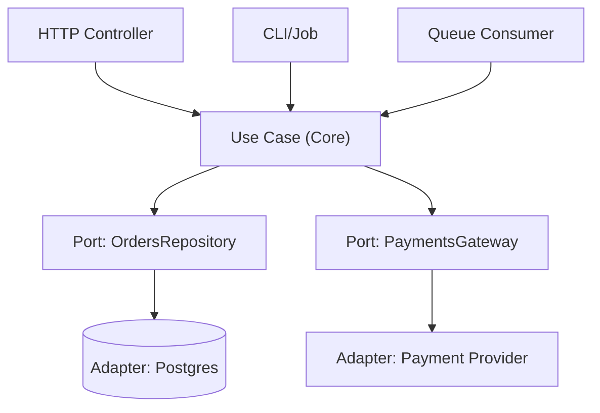

[Anterior](../principles/yagni.md) | [Índice](../../SUMMARY.md) | [Próximo](onion-architecture.md)

# Arquitetura Hexagonal (Ports & Adapters)

## Objetivos de Aprendizado (para quem está começando)

Ao final deste capítulo, você deve conseguir:

- Explicar, com suas palavras, o que é “core do sistema” e o que é “mundo externo”.
- Identificar no código quais partes são **portas (ports)** e quais são **adaptadores (adapters)**.
- Organizar um projeto simples sem misturar regra de negócio com HTTP, banco e SDKs.
- Escrever testes rápidos para regra de negócio sem precisar subir banco, fila ou servidor.

---

## Contexto, Escopo e Quando Usar

### Quando usar (sinais práticos)

- Você tem **regras de negócio** que mudam com frequência (não é só CRUD).
- Você integra com **múltiplas dependências externas**: banco, APIs, filas, cache, provedores.
- Você quer **testes rápidos** e confiáveis (sem depender de infra).
- Você sabe que pode precisar trocar detalhes (ex.: trocar Stripe por outro provedor).

### Quando não usar (para não criar complexidade à toa)

- Script pequeno, automação pontual, protótipo de poucos dias.
- CRUD simples com pouca regra e baixo risco.
- Time muito pequeno sem necessidade de múltiplas integrações.

---

## Glossário (o mínimo para conversar bem)

| Termo | O que é | Como aparece na prática |
|------|---------|--------------------------|
| Core | Regras e casos de uso do sistema | Funções/classes que decidem o que pode/não pode |
| Port (porta) | Um contrato que o core define | Interface `PaymentsPort`, `OrdersRepository` |
| Adapter | Implementação do contrato para um detalhe | `StripePaymentsAdapter`, `PostgresOrdersRepo` |
| Inbound (entrada) | Tudo que chama o core | HTTP controller, consumer de fila, CLI |
| Outbound (saída) | Tudo que o core chama | Banco, mensageria, APIs externas |
| Composition Root | Onde as dependências são montadas | `main`, startup, DI container |

---

## Modelo Mental (analogia para leigo)

Pense no sistema como um **restaurante**:

- O **core** é a cozinha: as receitas (regras) e o preparo (casos de uso).
- As **portas** são os “pedidos” e “saídas” que a cozinha entende (ex.: “fazer pedido”, “cobrar pagamento”, “salvar pedido”).
- Os **adaptadores** são os “garçons” e “entregadores”: um garçom atende no salão (HTTP), outro atende delivery (fila/evento). No fim, ambos entregam pedidos para a mesma cozinha.

O objetivo é que a cozinha funcione mesmo se você trocar:

- o app de delivery (adaptador)
- o tipo de caixa/pagamento (adaptador)
- o fornecedor (adaptador)

Sem reescrever receitas.

---

## Diagrama (como as peças se conectam)



Leitura do diagrama:

- Vários **canais de entrada** chamam o mesmo caso de uso.
- O caso de uso só conhece **ports**.
- Os detalhes (DB, SDK) ficam nos **adapters**.

---

## Passo a Passo (aplicando no mundo real)

1. Liste os **casos de uso** (verbos): “criar pedido”, “pagar pedido”, “cancelar”.
2. Para cada caso de uso, liste os **efeitos** que ele precisa produzir:
	 - persistir algo?
	 - chamar API externa?
	 - publicar evento?
3. Transforme cada efeito em uma **porta** (contrato) definida no core.
4. Implemente adaptadores de infra (DB, HTTP, SDKs) que atendem essas portas.
5. Monte tudo no **composition root** (ponto único de wiring).
6. Teste o core com fakes e spies antes de testar infraestrutura.

## Visão Geral e Contexto de Mercado

Arquitetura Hexagonal (Ports & Adapters) é um estilo arquitetural que coloca o **domínio e os casos de uso** no centro e trata “o mundo externo” (HTTP, banco, mensageria, cache, SDKs de terceiros) como **adaptadores substituíveis**. Em times profissionais, ela aparece como uma resposta pragmática a dois problemas recorrentes:

- Frameworks e ORMs virando o centro do sistema (e o domínio virando “detalhe”).
- Dificuldade de testar regras de negócio sem levantar infraestrutura.

Na prática, a promessa é reduzir o **custo de mudança**: você evolui regras, integrações e canais (API, worker, CLI) sem reescrever o core.

---

## Fundamentos, Evolução e Padrões de Mercado

- **Histórico e Evolução do Tema**  
  O termo “Hexagonal Architecture” é associado a Alistair Cockburn e popularizou a ideia de que o core deve ser acessado por múltiplos “lados” (UI, API, batch, testes) e que integrações externas devem ser isoladas. A forma mais útil de entender é: **dependências apontam para dentro**.

- **Conceitos-chave**
  - **Port (porta):** contrato definido “para dentro” (no core) para entrada/saída. Ex.: `CreateOrder`, `OrdersRepository`, `PaymentsGateway`.
  - **Adapter (adaptador):** implementação “para fora” (infra) que conversa com algo específico (PostgreSQL, Stripe, Kafka, HTTP).
  - **Input adapters:** entram no sistema (HTTP controllers, consumers de fila, CLI).
  - **Output adapters:** saem do sistema (persistência, gateways externos, publishers).
  - **Composition Root:** ponto único onde dependências são montadas (DI container, `main`, startup).

- **Padrões e Protocolos Usados no Mercado**
  - Contratos HTTP: OpenAPI.
  - Contratos assíncronos: AsyncAPI.
  - RPC: gRPC/Protobuf.
  - Observabilidade: OpenTelemetry (tracing/metrics/logs).
  - Contract tests (ex.: Pact) para reduzir acoplamento entre produtor/consumidor.

---

## Principais Desafios no Uso Profissional

- **Camadas cerimoniais**  
  Um risco comum é criar muitas interfaces e DTOs sem ganho real, especialmente em sistemas pequenos. Hexagonal se paga quando existe **complexidade de negócio** e/ou **múltiplas integrações**.

- **Ports mal definidos**  
  Se a porta “espelha” a tabela do banco ou o SDK de um provedor, você acoplou o domínio à infraestrutura por tabela. Ports devem refletir necessidades do domínio/caso de uso.

- **Modelagem e mapeamento**  
  Manter o domínio limpo geralmente exige mapeamento explícito (DTO ↔ domínio ↔ persistence model). Isso é trabalho extra, mas é o que compra isolamento.

- **Testes e flakiness**  
  Misturar infraestrutura em unit tests gera testes lentos e instáveis. O core deve ser testado com fakes/mocks; adapters, com testes de integração bem isolados.

---

## Estratégias Avançadas e Decisões Arquiteturais

- **Definir fronteiras (boundaries) com casos de uso**  
  Em vez de organizar por camadas técnicas (“controllers/services/repos”), organize o core por **casos de uso** (application layer) e invariantes (domain layer).

- **Composição de dependências**
  - O core define ports.
  - Infra implementa adapters.
  - O composition root injeta adapters no core.

- **Evolução segura: contrato primeiro**  
  Para integrações críticas, adote contract tests e versionamento de mensagens/DTOs. Isso reduz regressões quando adapters mudam.

- **Estratégia de testes**
  - Unit tests: casos de uso + domínio, com fakes.
  - Integration tests: adapters de banco/fila/http com infraestrutura real (testcontainers/ambiente efêmero).
  - E2E: poucos, cobrindo fluxos críticos.

---

## Exemplo Guiado (do zero, sem framework)

Vamos modelar um fluxo simples: **pagar um pedido**.

1) O core precisa de duas coisas externas:

- Buscar o pedido (port de repositório)
- Cobrar o pagamento (port de gateway)

2) O caso de uso decide e valida:

- “Se o total é 0, não paga.”
- “Se o pedido não existe, falha.”

3) A infraestrutura só traduz:

- HTTP → chama `PayOrderUseCase.execute()`
- Postgres/Stripe → implementam ports

Resultado: você consegue testar o caso de uso inteiro em memória.

## Exemplos Avançados (Python, C# e Go)

### Python (ports via Protocol + use case testável)

```python
from dataclasses import dataclass
from typing import Protocol


@dataclass(frozen=True)
class Order:
	id: str
	total_cents: int


class OrdersPort(Protocol):
	def get_by_id(self, order_id: str) -> Order: ...


class PaymentsPort(Protocol):
	def charge(self, order_id: str, amount_cents: int) -> None: ...


class PayOrderUseCase:
	def __init__(self, orders: OrdersPort, payments: PaymentsPort) -> None:
		self._orders = orders
		self._payments = payments

	def execute(self, order_id: str) -> None:
		order = self._orders.get_by_id(order_id)
		if order.total_cents <= 0:
			raise ValueError("invalid order total")
		self._payments.charge(order.id, order.total_cents)
```

```python
def test_pay_order_usecase_is_pure_and_fast():
	class FakeOrders:
		def get_by_id(self, order_id: str) -> Order:
			return Order(id=order_id, total_cents=1000)

	class SpyPayments:
		def __init__(self):
			self.calls = []

		def charge(self, order_id: str, amount_cents: int) -> None:
			self.calls.append((order_id, amount_cents))

	payments = SpyPayments()
	PayOrderUseCase(FakeOrders(), payments).execute("o-1")
	assert payments.calls == [("o-1", 1000)]
```

### C# (interfaces + DI friendly)

```csharp
public sealed record Order(string Id, int TotalCents);

public interface IOrdersPort
{
	Order GetById(string id);
}

public interface IPaymentsPort
{
	Task ChargeAsync(string orderId, int amountCents, CancellationToken ct = default);
}

public sealed class PayOrderUseCase
{
	private readonly IOrdersPort _orders;
	private readonly IPaymentsPort _payments;

	public PayOrderUseCase(IOrdersPort orders, IPaymentsPort payments)
	{
		_orders = orders;
		_payments = payments;
	}

	public async Task ExecuteAsync(string orderId, CancellationToken ct = default)
	{
		var order = _orders.GetById(orderId);
		if (order.TotalCents <= 0) throw new InvalidOperationException("invalid total");
		await _payments.ChargeAsync(order.Id, order.TotalCents, ct);
	}
}
```

### Go (interfaces pequenas + core isolado)

```go
package core

import "fmt"

type Order struct {
	ID         string
	TotalCents int
}

type OrdersPort interface {
	GetByID(id string) (Order, error)
}

type PaymentsPort interface {
	Charge(orderID string, amountCents int) error
}

type PayOrderUseCase struct {
	orders   OrdersPort
	payments PaymentsPort
}

func NewPayOrderUseCase(o OrdersPort, p PaymentsPort) *PayOrderUseCase {
	return &PayOrderUseCase{orders: o, payments: p}
}

func (uc *PayOrderUseCase) Execute(orderID string) error {
	order, err := uc.orders.GetByID(orderID)
	if err != nil {
		return err
	}
	if order.TotalCents <= 0 {
		return fmt.Errorf("invalid total")
	}
	return uc.payments.Charge(order.ID, order.TotalCents)
}
```

---

## Boas Práticas Sêniores e Armadilhas

- **Ports orientadas a intenção:** prefira `Charge(orderId, amount)` a `PostCharge(ChargeRequest)` se `ChargeRequest` for “do SDK”.
- **Domínio não conhece ORM/HTTP:** nada de `DbContext`, `Session`, `Request`, `Response` no core.
- **Adapte, não vaze:** adapters podem traduzir erros e modelos para tipos do domínio (ex.: `PaymentDeclined`).
- **Sem DI no domínio:** o core só recebe dependências por construtor/função; o container fica no composition root.
- **Cuidado com “anemic use cases”:** não transforme o core em um pass-through para repositórios; preserve regras e invariantes.

---

## Integração na Arquitetura Real

- **Docker/Kubernetes:** adapters de infra podem depender de env vars/secrets; o core não.
- **CI/CD:** separe stages de unit (core) e integração (adapters) para manter feedback rápido.
- **Observabilidade:** logs/traces normalmente entram nos adapters (entrada/saída) com correlação de request/trace-id; o core pode receber um port de observabilidade se necessário.
- **Infra-as-Code:** provisionamento (DB, filas) não deve vazar para o core; mantenha contratos e configurações na borda.

---

## Métricas, Monitoramento e Melhoria Contínua

- Tempo de execução de unit tests do core
- Quantidade de regressões por mudanças em integrações
- Lead time para introduzir/substituir um adapter (ex.: trocar provedor de pagamento)

---

## Frameworks e Ferramentas do Mercado

- **Python:** FastAPI/Flask (input adapters), SQLAlchemy (output adapter), pytest
- **C#:** ASP.NET Core (input adapters), EF Core (output adapter), xUnit/Moq
- **Go:** net/http (input), database/sql/sqlc (output), testify
- **Contratos/Observabilidade:** OpenAPI/AsyncAPI, Pact, OpenTelemetry

---

## Recursos Avançados e Leituras Recomendadas

- Alistair Cockburn — Hexagonal Architecture (Ports and Adapters)
- _Clean Architecture_ (Robert C. Martin)
- _Domain-Driven Design_ (Eric Evans)

---

## FAQ Especialista

**Isso é a mesma coisa que Clean Architecture?**  
São parentes próximos. Hexagonal é uma forma objetiva de implementar “dependências para dentro” com ports/adapters; Clean é uma família de princípios/estruturas com o mesmo objetivo.

**Quando NÃO usar?**  
Scripts e CRUDs simples que não têm regras significativas e não vão trocar integrações tendem a pagar o custo de indireção sem colher benefícios.

**Como escolher o que vira port?**  
Tudo que é volátil e externo ao domínio: persistência, mensageria, gateways, relógio (`Clock`), geração de IDs, feature flags, etc.

---

## Referências e Práticas do Mercado

- OpenTelemetry (instrumentação de entrada/saída)
- Pact (contract testing)

---

## Exercícios (para fixar)

1) Pegue um CRUD que você já tem e responda:

- Quais são os 3 casos de uso principais (verbos)?
- Quais dependências externas aparecem dentro das regras?

2) Crie uma porta `Clock` (relógio) e remova usos diretos de “hora atual” do core.

3) Escreva um teste de caso de uso usando um fake de repositório e um spy de gateway.

---

[Anterior](../principles/yagni.md) | [Índice](../../SUMMARY.md) | [Próximo](onion-architecture.md)
