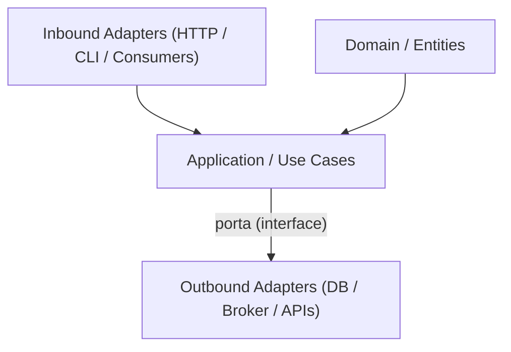

[Anterior](hexagonal-architecture.md) | [Índice](../../SUMMARY.md) | [Próximo](clean-architecture.md)

# Onion Architecture — Arquitetura em Cebola (nível Sênior / Especialista)

## Objetivos de Aprendizado (para leigos e iniciantes)

Ao terminar este capítulo, você consegue:

- Explicar a Onion em uma frase: “o negócio não depende de detalhes externos”.
- Identificar o que é **domínio**, o que é **caso de uso**, e o que é **infra**.
- Separar “regras” (core) de “conectores” (HTTP/DB/mensageria).
- Montar um projeto com camadas sem virar “pasta por pasta sem propósito”.

---

## Modelo Mental (a cebola)

Imagine uma cebola com anéis. O centro é o que mais importa (as regras do negócio). Quanto mais você vai para fora, mais aparecem detalhes “trocáveis” (framework web, banco, SDKs).

- **Anéis internos**: regras e decisões do negócio.
- **Anéis externos**: detalhes de tecnologia e integração.
- **Regra de ouro**: dependências apontam para dentro (o centro não “importa” o mundo).

---

## Glossário Essencial

| Termo | Significa | Exemplo |
|---|---|---|
| Domínio (Domain) | Regras e invariantes do negócio | “E-mail deve ser único” |
| Caso de uso (Use case) | Fluxo de negócio orquestrado | “Cadastrar cliente” |
| Porta (Port) | Contrato que o core precisa | `CustomersRepository` |
| Adaptador (Adapter) | Implementação de uma porta | Repo SQL, client HTTP |
| Inbound | Entrada no sistema | Controller HTTP, consumer |
| Outbound | Saída para fora | DB, fila, API externa |
| Composition Root | Lugar onde “liga os fios” | `main`, DI container |

---

## Diagrama Rápido

O diagrama abaixo é intencionalmente simples: ele serve para você “ver” quem depende de quem.



Leitura correta:

- Inbound chama casos de uso.
- Casos de uso falam com o “mundo externo” por **portas**.
- Infra implementa as portas e fica “do lado de fora”.

---

## Como Aplicar (passo a passo)

1. Liste os **casos de uso** (verbos do negócio): cadastrar, pagar, cancelar, reconciliar.
2. Para cada caso de uso, separe:
	 - Regras/invariantes (core)
	 - Efeitos/IO (DB, HTTP, publish de evento)
3. Crie **portas** no core para o que for IO.
4. Implemente **adaptadores** de fora para dentro (infra implementa a porta).
5. Tenha um **composition root** que conecta as dependências.
6. Garanta com testes e/ou regras de import que o core não puxa infra.

---

## Exemplo Guiado (o que você já viu nos códigos)

Quando você olha para o caso de uso `RegisterCustomer` (nos exemplos abaixo), a ideia é:

- O caso de uso recebe um **repositório por interface** (`CustomersRepository`).
- A regra “e-mail válido” e “e-mail único” fica no core.
- O repositório real (SQL, Mongo, Redis) fica **fora** e só é “plugado” no composition root.

Se você consegue trocar `InMemoryRepo` por “PostgresRepo” sem mexer no caso de uso, você está aplicando a Onion.

## Visão Geral e Contexto de Mercado

Onion Architecture (Arquitetura em Cebola) é um estilo arquitetural focado na **regra de dependência**: o centro (domínio) não depende de detalhes externos. Ela é muito aplicada em sistemas onde o negócio é a parte mais valiosa (fintech, logística, saúde, seguros) e onde integrações (banco de dados, mensageria, APIs externas) mudam com frequência.

Em times modernos (squads ágeis, CI/CD, microserviços), a Onion ajuda a:

- Evitar que frameworks (web/ORM) “puxem” o design e contaminem o core.
- Manter testes rápidos e determinísticos para regras de negócio.
- Evoluir canais (HTTP, eventos, batch) sem reescrever a lógica.

No mercado, ela costuma aparecer como:

- Organização por **camadas concêntricas** (Domain → Application → Infrastructure/Presentation).
- Uma implementação prática de **Dependency Inversion** e **Separation of Concerns**.

---

## Fundamentos, Evolução e Padrões de Mercado

- **Histórico e Evolução do Tema**  
  A Onion Architecture popularizou a ideia de separar o core do sistema (entidades, regras, casos de uso) de mecanismos externos. Ela dialoga com conceitos de DDD (domínio rico), Clean Architecture e Ports & Adapters. A diferença prática costuma estar na **forma de organizar camadas** e na ênfase em “anéis” de dependência.

- **Padrões e Protocolos Usados no Mercado**
  - **DIP (Dependency Inversion Principle):** interfaces no core, implementações na borda.
  - **Application Services / Use Cases:** orquestram regras e ports.
  - **Repositories / Gateways:** contratos para persistência e integrações.
  - **DTOs/Contracts:** OpenAPI/AsyncAPI/Protobuf para fronteiras externas.
  - **Observabilidade:** OpenTelemetry (principalmente nos adaptadores de entrada/saída).

---

## Principais Desafios no Uso Profissional

- **Escalabilidade dos Testes/Padrões**  
  Em sistemas grandes, é comum confundir “camadas” com “pastas”. O desafio é manter a regra de dependência real (compilação/imports) e não apenas estética. Testes do core devem permanecer rápidos, mesmo com crescimento do sistema.

- **Performance e Manutenção**  
  - Mapeamentos (DTO ↔ domínio ↔ persistência) aumentam custo de manutenção.
  - Se você duplicar camadas sem propósito, cria indireção e reduz legibilidade.
  - A performance raramente piora por camadas em si; piora quando há chamadas remotas/IO desnecessárias ou quando o design incentiva “chatty interfaces”.

- **Gerenciamento Técnico (Debt, Coverage, Flakiness)**  
  - Debt aparece quando infra vaza para o core (ex.: ORM no domínio).
  - Coverage “de verdade” precisa cobrir regras e invariantes, não getters/setters.
  - Flakiness tende a vir de testes que dependem de banco/rede sem isolamento.

---

## Estratégias Avançadas e Decisões Arquiteturais

- **Integração com CI/CD**
  - Pipeline recomendado: lint/typecheck → unit tests (domain/application) → integration tests (infra) → contract tests → e2e (mínimo).
  - Faça o core ser “barato” de testar para manter feedback rápido em PR.

- **Práticas de mercado: Pirâmide de Testes, Testes em múltiplos ambientes, mocks de infraestrutura**
  - Use **fakes** para ports do core e reserve mocks para pontos voláteis.
  - Use testcontainers/ambientes efêmeros para integração de infra.
  - Para integrações entre serviços, use contract tests (Pact) quando fizer sentido.

- **Métrica de Qualidade**  
  - Coverage útil (branch/mutation) do core.
  - Tempo total dos unit tests e taxa de flakiness em integration/e2e.
  - Frequência de mudanças em infra que quebram o core (sinal de acoplamento).

---

## Exemplos Avançados (Python, C# e Go)

### Python

Exemplo de estrutura (domínio e aplicação independentes) com uma “porta” para persistência.

```python
from dataclasses import dataclass
from typing import Protocol


@dataclass(frozen=True)
class Customer:
	id: str
	email: str


class CustomersRepository(Protocol):
	def get_by_email(self, email: str) -> Customer | None: ...
	def save(self, customer: Customer) -> None: ...


class RegisterCustomer:
	def __init__(self, repo: CustomersRepository) -> None:
		self._repo = repo

	def execute(self, email: str) -> Customer:
		email = email.strip().lower()
		if "@" not in email:
			raise ValueError("invalid email")

		if self._repo.get_by_email(email) is not None:
			raise ValueError("email already registered")

		customer = Customer(id="generated-id", email=email)
		self._repo.save(customer)
		return customer
```

```python
def test_register_customer_is_fast_and_pure():
	store: dict[str, Customer] = {}

	class InMemoryRepo:
		def get_by_email(self, email: str) -> Customer | None:
			return store.get(email)

		def save(self, customer: Customer) -> None:
			store[customer.email] = customer

	uc = RegisterCustomer(InMemoryRepo())
	customer = uc.execute("User@Example.com")
	assert customer.email == "user@example.com"
	assert store["user@example.com"].id == customer.id
```

### C#

```csharp
public sealed record Customer(string Id, string Email);

public interface ICustomersRepository
{
	Customer? GetByEmail(string email);
	void Save(Customer customer);
}

public sealed class RegisterCustomer
{
	private readonly ICustomersRepository _repo;

	public RegisterCustomer(ICustomersRepository repo) => _repo = repo;

	public Customer Execute(string email)
	{
		var normalized = email.Trim().ToLowerInvariant();
		if (!normalized.Contains("@")) throw new ArgumentException("invalid email");

		if (_repo.GetByEmail(normalized) is not null)
			throw new InvalidOperationException("email already registered");

		var customer = new Customer(Guid.NewGuid().ToString("N"), normalized);
		_repo.Save(customer);
		return customer;
	}
}
```

### Go

```go
package app

import (
	"fmt"
	"strings"
)

type Customer struct {
	ID    string
	Email string
}

type CustomersRepository interface {
	GetByEmail(email string) (*Customer, error)
	Save(c Customer) error
}

type RegisterCustomer struct {
	repo CustomersRepository
}

func NewRegisterCustomer(r CustomersRepository) *RegisterCustomer {
	return &RegisterCustomer{repo: r}
}

func (uc *RegisterCustomer) Execute(email string) (Customer, error) {
	normalized := strings.ToLower(strings.TrimSpace(email))
	if !strings.Contains(normalized, "@") {
		return Customer{}, fmt.Errorf("invalid email")
	}

	existing, err := uc.repo.GetByEmail(normalized)
	if err != nil {
		return Customer{}, err
	}
	if existing != nil {
		return Customer{}, fmt.Errorf("email already registered")
	}

	c := Customer{ID: "generated-id", Email: normalized}
	if err := uc.repo.Save(c); err != nil {
		return Customer{}, err
	}
	return c, nil
}
```

---

## Boas Práticas Sêniores e Armadilhas

- **Garanta a regra de dependência com tooling:** lint/arquitetura (ex.: testes que impedem imports proibidos) para evitar “vazamento” entre camadas.
- **Camadas são sobre dependências, não sobre quantidade de pastas:** mantenha o design simples e consistente.
- **Evite que o domínio vire anêmico:** coloque invariantes e comportamentos no domínio quando fizer sentido.
- **Não exponha modelos de persistência para o core:** use mapeamento explícito (pode ser manual) e aceite o custo como investimento.
- **Use cases devem ser finos, mas não vazios:** eles orquestram regras e portas; se só chamam repositório, há risco de design acidental.

---

## Integração na Arquitetura Real

- **Orquestração com Docker/Kubernetes:** mantenha o core independente; adapters leem config/env/secrets e publicam métricas/traces.
- **Pipelines CI/CD:** unit tests do core como “fast gate”; integration/e2e como gates progressivos.
- **Integração com ferramentas de QA, análise estática, monitoramento pós-deploy:** instrumente bordas (entrada/saída) e correlacione com trace-id.
- **Testes e Infra-as-Code:** use ambientes efêmeros para adapters e mantenha contratos versionados.

---

## Métricas, Monitoramento e Melhoria Contínua

- Tempo de execução de unit tests (core)
- Taxa de flakiness (integration/e2e)
- Frequência de regressões ligadas a infra
- Lead time para introduzir um novo canal (ex.: consumer) ou trocar um adapter

---

## Frameworks e Ferramentas do Mercado

- **Python:** pytest, FastAPI/Flask (adapters), SQLAlchemy (adapter), mypy
- **C#:** xUnit, Moq, ASP.NET Core (adapters), EF Core (adapter)
- **Go:** testing, testify, net/http, sqlc/database/sql
- **Ferramentas de integração:** GitHub Actions/Azure DevOps/Jenkins, SonarQube/SonarCloud, OpenTelemetry

---

## Recursos Avançados e Leituras Recomendadas

- _Clean Architecture_ (Robert C. Martin)
- _Domain-Driven Design_ (Eric Evans)
- Artigos e talks sobre Onion/Clean/Hexagonal (comparativos e trade-offs)

---

## FAQ Especialista

**Onion e Hexagonal são a mesma coisa?**  
Elas são muito próximas em objetivo (proteger o domínio), mas diferem no “modelo mental” dominante: Onion enfatiza anéis/camadas; Hexagonal enfatiza portas/adaptadores. Na prática, é comum ver as duas convergindo na implementação.

**Como evitar acoplamento acidental ao framework web?**  
Mantenha controllers/handlers como adaptadores finos que traduzem request/response para chamadas de casos de uso. Não passe objetos do framework para dentro.

**Como “policiar” imports proibidos?**  
Crie regras (ex.: testes de arquitetura) que falham se `domain` importar `infrastructure`/`web`. Em Go/C# isso pode ser feito por organização de módulos/projetos; em Python, por convenção + checagens.

---

## Referências e Práticas do Mercado

- ThoughtWorks Tech Radar (arquiteturas e práticas)
- OpenTelemetry (observabilidade)
- Pact (contract testing)

---

[Anterior](hexagonal-architecture.md) | [Índice](../../SUMMARY.md) | [Próximo](clean-architecture.md)
