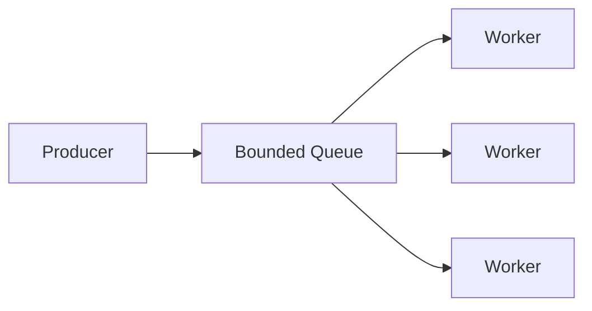

[Anterior](classic-concurrency-problems.md) | [Índice](../../SUMMARY.md) | [Próximo](testing-and-debugging-concurrency.md)

# Async, Work Queues e Backpressure — Concurrency no Mundo Real (Nível Sênior)

## Visão Geral e Contexto de Mercado

Muitos sistemas modernos usam concorrencia para **esconder latencia de IO** e **controlar capacidade**. O erro comum e escalar concorrencia sem limites, gerando:

- filas internas infinitas
- OOM por backlog
- p99 ruim por saturacao
- cascata de retries

A disciplina central aqui e: **capacidade e um recurso**. Backpressure e parte do design.

Um bom dev senior consegue olhar para um sistema e responder:

- Onde existe fila (explicita ou implicita)?
- O que acontece quando a fila enche?
- Qual e o contrato quando o downstream esta lento?

Esse capitulo existe para transformar essas perguntas em design pratico.

---

## Conceitos que senior precisa dominar

- **IO-bound vs CPU-bound**: async ajuda no primeiro, nao no segundo.
- **Event loop e cooperative scheduling**: tasks precisam ceder.
- **Structured concurrency**: escopo de tasks e cancelamento.
- **Bounded queues**: fila limitada e uma protecao, nao um inconveniente.

### Fila como modelo mental (o que realmente esta acontecendo)

Sempre que voce ve concorrencia, existe uma fila em algum lugar:

- fila explicita (broker, channel, buffer)
- fila implicita (pool de threads, fila do event loop, backlog do kernel)

Fila e um "absorvedor de burst". Mas fila ilimitada e uma forma de **adiar o problema** ate virar incidente.

### Little's Law (intuicao que evita muitos erros)

Sem entrar em matematica pesada, existe uma relacao simples:

$$L = \lambda W$$

Onde:

- $L$ = itens no sistema (backlog)
- $\lambda$ = taxa de chegada (requests/seg)
- $W$ = tempo medio no sistema (latencia)

Interpretacao pratica:

- Se o tempo de processamento sobe (downstream lento), backlog sobe.
- Se backlog sobe, latencia sobe (itens esperam mais).
- Se latencia sobe, timeouts e retries sobem, piorando a taxa efetiva de chegada.

Isso explica por que overload costuma virar espiral.

---

## Padroes praticos

### Worker pool com fila limitada



- Fila limitada sinaliza overload.
- Workers consomem no ritmo sustentavel.

O detalhe de senior e: **o valor da fila limitada e forcar uma decisao**. Quando a fila enche, voce precisa escolher uma politica (nao deixar "o runtime" decidir por voce via OOM).

### Backpressure strategies

- **Drop**: descartar (melhor para telemetria do que para dinheiro).
- **Reject**: responder 429/503 rapidamente.
- **Buffer**: aceitar e enfileirar (com limite).
- **Shed load**: degradar features nao criticas.

#### Contratos claros (o que o consumidor espera do produtor)

Backpressure nao e apenas um mecanismo. E um contrato entre componentes:

- O produtor sabe quando reduzir ritmo?
- O consumidor consegue sinalizar saturacao?
- Existe uma resposta padrao (429/503) e um retry-after?

Sem contrato, cada time implementa retry diferente e a plataforma vira instavel.

---

## Cancelamento e timeouts

- Cancelamento precisa ser **propagado** (context/cancellation token).
- Timeouts previnem bloqueio infinito e limitam caudas (p99).

### Cancelamento como parte da corretude

Em sistemas async, cancelamento e facil de "esquecer". O resultado e:

- request encerra, mas o trabalho continua (custo)
- jobs duplicados aparecem quando um retry inicia outro trabalho

Senior define:

- onde o cancelamento entra (request boundary)
- onde ele deve ser checado (pontos de espera e loops)
- como o sistema finaliza com seguranca (cleanup)

---

## Exemplos

### Go: worker pool com context

```go
func worker(ctx context.Context, jobs <-chan Job) {
    for {
        select {
        case <-ctx.Done():
            return
        case j, ok := <-jobs:
            if !ok { return }
            j.Run(ctx)
        }
    }
}
```

### Python asyncio: limitar concorrencia

```python
import asyncio

sem = asyncio.Semaphore(50)

async def bounded(task):
    async with sem:
        return await task
```

### C# Channels: fila limitada

```csharp
var channel = Channel.CreateBounded<Job>(new BoundedChannelOptions(1000)
{
    FullMode = BoundedChannelFullMode.Wait
});
```

O ponto do exemplo nao e a sintaxe, e a politica:

- `Wait` significa que voce aceita aplicar backpressure no produtor.
- Se o produtor for request HTTP, isso pode virar timeout. Entao muitas vezes `Reject` e mais previsivel.

---

## Falhas e operacao

- Fila crescendo: medir `queue_depth` e `queue_age`.
- Retentativas: precisam de idempotencia e jitter.
- Poison messages: DLQ/quarantine.
- Head-of-line blocking: separar filas por classe de trabalho.

### Falha tipica 1: overload do downstream (provider lento)

Sintoma:

- p99 sobe, queue_age sobe, retries sobem.

Correcao estrutural:

- reduzir concorrencia maxima para aquele downstream (semaphore)
- circuit breaker + retry com jitter e limite
- shed load para requests menos criticas

### Falha tipica 2: fila unica com classes diferentes (head-of-line)

Quando jobs curtos e longos competem na mesma fila, jobs longos dominam e geram cauda.

Mitigacao:

- separar filas (por tipo/prioridade)
- definir quotas (percentual de workers)

### Falha tipica 3: poison message

Uma mensagem sempre falha e reentra na fila, ocupando recursos.

Mitigacao:

- limite de retries
- quarantine/DLQ
- observabilidade por reason code

---

## Observabilidade minima

- Throughput por worker
- Lag e idade da fila
- p95/p99 do job
- Taxa de retry e DLQ

## Observabilidade (explicado como livro)

### Percentis (p95/p99) do job

Percentis sao essenciais para async porque backlog e contencao aparecem primeiro na cauda.

- Se `p50` esta ok mas `p99` explodiu, geralmente ha espera em fila/lock/downstream.
- `p99` do job deve ser medido por tipo de job, nao apenas global.

Boas praticas:

- Use histogramas (ou ferramenta equivalente) para calcular percentis.
- Registre unidade e escopo (ex.: `job_latency_seconds{job_type="capture"}`).

### Queue depth vs queue age (o par que evita interpretacao errada)

- `queue_depth`: quantidade esperando agora.
- `queue_age`: quanto tempo o item mais antigo esta esperando.

Interpretacao:

- `queue_depth` alto pode ser burst.
- `queue_age` subindo continuamente significa que o sistema nao esta drenando.

### Consumer lag (quando existe broker/stream)

Lag mede atraso entre producao e consumo. Lag alto significa:

- risco de SLA (eventos velhos)
- risco de backlog crescer ate estourar limites

### Retries, dedup e DLQ

- `retries_total`: por causa (timeout, 5xx, throttling).
- `dedup_hits_total`: duplicidade evitada (normal em at-least-once).
- `dlq_total`: falhas permanentes (precisa playbook).

Quando `retries_total` sobe junto com `p99` e `queue_age`, trate como overload/contencao.

---

## SLOs e alertas (exemplos praticos)

Exemplos de SLO (ajuste para seu dominio):

- Job critico: `p99(job_latency) < 2s` e `queue_age < 30s`.
- Broker: `consumer_lag < 60s`.
- DLQ: `dlq_total` deve ser ~0; qualquer crescimento exige triagem.

Alertas acionaveis (evite ruido):

- `queue_age` acima do limite por X minutos (nao apenas pico rapido).
- `p99` acima do limite + `retries_total` aumentando (espiral de overload).
- `dlq_total` aumentando (falha permanente).

---

## Estudos de caso (do desenho ao incidente)

### Caso A: "Aumentamos concorrencia e piorou"

Situacao:

- Time aumenta `maxConcurrency` para "drenar fila".
- Resultado: downstream colapsa, timeouts aumentam, retries disparam.

Explicacao:

- Se o gargalo e downstream, mais concorrencia aumenta pressao e contencao.
- Voce troca backlog por falhas e cauda.

Mitigacao:

- limitar concorrencia por downstream (semaphore)
- circuit breaker
- retry com jitter e limite

Mini-runbook:

1. Verificar `queue_age`, `p99`, `retries_total`.
2. Confirmar saturacao do downstream via tracing.
3. Reduzir concorrencia maxima e aplicar shed load.

### Caso B: "Fila unica gerou cauda e starvation"

Situacao:

- Jobs longos entram e seguram workers.
- Jobs curtos ficam esperando, p99 explode.

Mitigacao:

- separar filas por classe (short/long, prioridade)
- quotas por worker pool

Mini-runbook:

1. Quebrar latencia por `job_type`.
2. Identificar classe dominando.
3. Separar filas e ajustar quotas.

### Caso C: "Poison message derrubou throughput"

Situacao:

- Uma mensagem falha sempre.
- Reentrega infinita consome workers.

Mitigacao:

- limite de retries
- DLQ/quarantine com reason codes
- playbook de triagem

Mini-runbook:

1. Confirmar aumento de `dlq_total` ou retries repetidos para o mesmo id.
2. Quarentenar mensagem e reduzir impacto no fluxo principal.
3. Corrigir bug e reprocessar DLQ com idempotencia.

---

[Anterior](classic-concurrency-problems.md) | [Índice](../../SUMMARY.md) | [Próximo](testing-and-debugging-concurrency.md)
