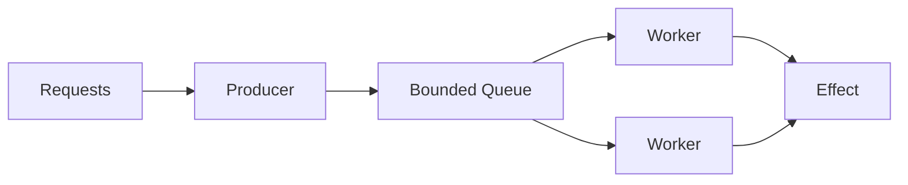
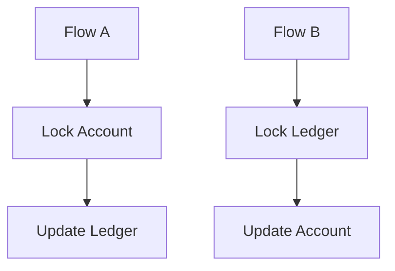

[Anterior](synchronization-primitives-and-contention.md) | [Índice](../../SUMMARY.md) | [Próximo](async-concurrency-and-backpressure.md)

# Classic Concurrency Problems — Guia Prático (Nível Sênior)

## Visão Geral e Contexto de Mercado

Os “problemas clássicos” de concorrência são importantes porque eles aparecem disfarçados em bugs reais: processamento duplicado, ordens inconsistentes, filas travadas e serviços que entram em degradação sob pico.

No mercado, você não “resolve dining philosophers”; você resolve:

- Dois workers processando a mesma mensagem
- Uma atualização concorrente perdendo estado (lost update)
- Um deadlock de DB em pico
- Um lock global causando p99 alto

O valor desses clássicos é oferecer um vocabulário e um conjunto de padrões para diagnosticar e corrigir.

---

## Fundamentos, Evolução e Padrões de Mercado

- **Histórico e Evolução do Tema**  
	Os problemas clássicos surgiram para explicar limites e perigos de sincronização. Em sistemas modernos, os mesmos padrões reaparecem em bancos (locks), filas (competing consumers), caches (stampede) e serviços distribuídos (sagas/retries).

- **Padrões e Protocolos Usados no Mercado**
	- **Mutual exclusion:** mutex/lock, critical section.
	- **Semáforos:** limitar concorrência e coordenar recursos.
	- **Condition variables / wait-notify:** sincronizar eventos.
	- **Channels/queues:** comunicação segura por mensagens.
	- **Optimistic concurrency:** versões/ETags para evitar lost update.
	- **Idempotência e dedupe:** para reprocessamento e at-least-once.

Um detalhe importante para uso profissional: muitos problemas "classicos" nao sao sobre a primitiva em si, mas sobre **politica**:

- ordem de locks
- limites de concorrencia
- backlog e backpressure
- transicoes de estado validas

---

## Principais Desafios no Uso Profissional

- **Escalabilidade dos Testes/Padrões**  
	O bug costuma depender de timing e carga. Se você não força concorrência nos testes (stress/race), ele aparece só em produção.

- **Performance e Manutenção**  
	- Soluções “seguras” podem ser lentas (lock global).
	- Soluções “rápidas” podem ser erradas (lock insuficiente).
	- Diagnóstico exige métricas e visibilidade de bloqueios.

- **Gerenciamento Técnico (Debt, Coverage, Flakiness)**  
	- Debt: sincronização espalhada e sem invariantes.
	- Coverage: ausência de testes que exercitam interleavings.
	- Flakiness: testes com `sleep` e tempos reais.

---

## Estratégias Avançadas e Decisões Arquiteturais

- **Integração com CI/CD**
	- Stress tests e race detection (quando disponível) como parte do pipeline.
	- Testes de idempotência para handlers e jobs.
	- Monitoramento de deadlocks/timeouts e alarmes por p99.

- **Práticas de mercado: Pirâmide de Testes, Testes em múltiplos ambientes, mocks de infraestrutura**
	- Unit: proteger invariantes e comportamento sob concorrência local.
	- Integração: DB/Redis/broker real para validar locking e competing consumers.
	- E2E: fluxos críticos com repetição e carga.

- **Métrica de Qualidade**  
	- Taxa de deadlocks/timeouts
	- Duplicação (idempotency failures)
	- Tempo de fila/lag
	- Throughput e p95/p99

---

## Exemplos Avançados (Python, C# e Go)

Exemplos didáticos de três problemas clássicos: race condition, deadlock (por ordem de locks) e lost update (com controle otimista).

### Producer-consumer (bounded buffer) e o que isso vira em producao

O classico "producer-consumer" aparece como:

- fila interna de um servico
- pool de conexoes
- limiting de requests para um provider

O ponto central: **fila ilimitada e um bug de capacidade**.


### Python

```python
import threading


lock_a = threading.Lock()
lock_b = threading.Lock()


def safe_lock_order():
		# Regra de mercado: ordem fixa evita deadlock.
		with lock_a:
				with lock_b:
						return "ok"
```

### C#

```csharp
// Lost update prevention (conceitual) via optimistic concurrency.
public sealed record Account(string Id, int Balance, int Version);

public sealed class ConcurrencyException : Exception { }

public interface IAccountsRepo {
		Account Get(string id);
		void Save(Account account, int expectedVersion);
}

public sealed class Service
{
		private readonly IAccountsRepo _repo;
		public Service(IAccountsRepo repo) => _repo = repo;

		public void Deposit(string id, int amount)
		{
				var acc = _repo.Get(id);
				var updated = acc with { Balance = acc.Balance + amount, Version = acc.Version + 1 };
				_repo.Save(updated, expectedVersion: acc.Version);
		}
}
```

### Go

```go
package locks

import "sync"

var a sync.Mutex
var b sync.Mutex

func SafeOrder() {
		a.Lock()
		defer a.Unlock()
		b.Lock()
		defer b.Unlock()
		// critical section
}
```

---

## Estudos de Caso (do classico ao incidente)

Esta secao transforma os classicos em "receitas" que voce consegue aplicar em design review e em incidente.

### Caso 1: Producer-consumer vira backlog, OOM e p99 alto

#### Sintoma em producao

- A fila interna cresce sem parar em pico.
- O processo consome memoria ate reiniciar.
- p99 piora e timeouts aumentam, gerando **cascata de retries**.

#### Invariantes e objetivos

- A capacidade maxima do sistema deve ser limitada por design.
- Sob overload, o sistema deve **degradar de forma previsivel**.
- O backlog deve ser observavel: tamanho e idade da fila.

#### Design minimo (bounded queue + workers)



Decisoes praticas:

- **Fila limitada** (nao-negociavel). Sem limite, voce transforma overload em OOM.
- **Workers limitados** (concorrencia maxima). O valor vem de capacidade do downstream (DB, provider).
- **Politica quando a fila enche**:
	- `Reject` (429/503) para requests sincronos.
	- `Drop` para telemetria.
	- `Wait` com timeout para jobs internos.

#### Algoritmo (pseudo)

```text
on_request(req):
  if queue.is_full():
    return reject_fast()
  enqueue(req)

worker_loop():
  req = dequeue()
  process(req)  # idempotent if it can retry
```

#### Armadilhas

- "Aumentar threads" sem limite de fila so piora a saturacao.
- Um unico tipo de fila para tudo cria head-of-line blocking.
- Retry sem jitter e sem limite vira ataque em cima do proprio sistema.

#### Metricas e alertas (minimo)

- `queue_depth` (gauge)
- `queue_age_seconds` (histogram ou max)
- `worker_utilization` (gauge)
- `rejected_total` (counter)
- `job_latency_seconds` p95/p99

Alertas acionaveis:

- `queue_age_seconds` acima de X por Y minutos (risco de SLA)
- taxa de `rejected_total` subindo (overload)

#### Mini-runbook

1. Verificar `queue_age_seconds` e p99.
2. Confirmar qual downstream esta saturando (DB, cache, provider) via tracing.
3. Aplicar mitigacao:
	- reduzir concorrencia maxima (se downstream esta colapsando)
	- aumentar capacidade (scale) se houver folga real
	- habilitar shed load (desligar features nao criticas)
4. Checar retries e circuit breakers (evitar cascata).

---

### Caso 2: Deadlock em pico (DB + locks de aplicacao)

#### Sintoma em producao

- Em pico, transacoes comecam a falhar com deadlock/timeout.
- p99 sobe, workers ficam bloqueados, backlog cresce.

Deadlock e uma combinacao de:

- exclusao mutua
- retencao de recurso
- ausencia de preempcao
- espera circular

#### Exemplo realista

Dois fluxos:

- Fluxo A: lock local do `Account` -> atualiza `Ledger` no DB
- Fluxo B: lock local do `Ledger` -> atualiza `Account` no DB

Mesmo que cada fluxo pareca "correto", a ordem diferente cria risco de deadlock.



#### Invariantes e politicas

- Ordem unica de locks: `Account` antes de `Ledger`.
- Nunca segurar lock local enquanto faz IO remoto lento.
- Timeout para aquisicao de lock (quando aplicavel).

#### Mitigacoes por camadas

**Camada 1: politica de lock (aplicacao)**

- Defina uma funcao utilitaria que adquira locks em ordem canonica.
- Em code review, bloquear qualquer nova ordem.

**Camada 2: transacao e locking (DB)**

- Manter transacoes curtas (evitar chamadas remotas dentro).
- Indexacao correta (lock escalation e scans pioram contencao).
- Se usar `SELECT ... FOR UPDATE`, garantir ordem consistente.

**Camada 3: resiliencia**

- Detectar deadlock e aplicar retry com jitter e limite.
- Se for operacao critica, sair para reconciliacao quando exceder limite.

#### Metricas e alertas

- `db_deadlocks_total`
- `db_lock_wait_seconds` (histogram)
- `tx_duration_seconds` p95/p99
- `lock_acquire_timeout_total`

#### Mini-runbook

1. Confirmar se e deadlock real (erro do DB) ou timeout por saturacao.
2. Coletar uma amostra de queries/transacoes envolvidas.
3. Identificar ordem de locks (app e DB). Procurar ciclos.
4. Mitigar:
	- reduzir tempo de transacao (remover IO dentro)
	- impor ordem
	- reduzir concorrencia maxima temporariamente
5. Ajuste permanente: indexacao/queries e politicas de lock.

---

### Caso 3: Lost update em saldo/contador (controle otimista)

#### Sintoma em producao

- Dois updates concorrentes "passam" e um efeito se perde.
- Em pagamentos: saldo divergente, ajustes manuais, reconciliacao dolorosa.

#### Invariante

- Toda mudanca em um aggregate deve ser aplicada sobre uma versao conhecida.

#### Padrao de controle otimista (versao)

Ideia:

1. Ler registro com `version`.
2. Calcular novo estado.
3. Persistir com `WHERE version = expected`.
4. Se 0 linhas afetadas, houve concorrencia: recarregar e tentar de novo.

Exemplo em pseudo-SQL:

```sql
update accounts
set balance_cents = balance_cents + :delta,
    version = version + 1
where id = :id and version = :expected_version;
```

#### Onde isso falha

- Retries sem limite sob alta contencao viram livelock.
- Se o trabalho entre ler e escrever for lento (IO), voce aumenta conflitos.
- Se o delta nao for validado (ex.: saldo nao pode ficar negativo), voce precisa validar na mesma transacao.

#### Estrategias de mitigacao

- Backoff com jitter em conflitos.
- Particionar por chave (shard) quando uma unica chave e hotspot.
- Trocar por locking pessimista apenas para hotspots.
- Para dinheiro: muitas vezes a evolucao e ir para **ledger append-only** e derivar saldo (evita updates destrutivos).

#### Metricas e alertas

- `optimistic_conflicts_total`
- `optimistic_retries_total`
- latencia por tentativa (p95/p99)
- hotspots: top keys por taxa de conflito

#### Mini-runbook

1. Verificar `optimistic_conflicts_total` e keys mais conflitantes.
2. Confirmar se ha burst de requests para o mesmo aggregate.
3. Mitigar:
	- aplicar backoff e reduzir concorrencia para aquela chave
	- se necessario, lock pessimista temporario
4. Correcao estrutural: mover efeitos para ledger append-only e reconciliar/projetar saldo.

---

## Boas Práticas Sêniores e Armadilhas

- **Ordem de locks é uma política:** documente e aplique (code review).
- **Evite lock global:** prefira granularidade por chave/aggregate.
- **Use timeouts e degrade:** bloquear indefinidamente é convite para incidentes.
- **Idempotência para processamento assíncrono:** handlers precisam suportar duplicação.
- **Controle otimista em atualizações concorrentes:** ETags/version em APIs e DB.

### Como ligar o classico ao mundo real

- Readers-writers: cache + invalidacao + thundering herd.
- Dining philosophers: deadlock por dependencia circular de recursos (ex.: DB + cache + lock local).
- Sleeping barber: filas com capacidade e fairness.

O ganho aqui e diagnostico: voce enxerga o pattern por tras do incidente.

---

## Integração na Arquitetura Real

- **Orquestração com Docker/Kubernetes:** picos e autoscaling alteram concorrência efetiva; proteja recursos com limites.
- **Pipelines CI/CD:** testes de stress/race e validação de idempotência.
- **Integração com ferramentas de QA, análise estática, monitoramento pós-deploy:** tracing e métricas de bloqueio/lag.
- **Testes e Infra-as-Code:** brokers/DB provisionados para testes de concorrência.

---

## Métricas, Monitoramento e Melhoria Contínua

- Deadlocks/timeouts
- Retries e DLQ (se houver fila)
- Lag de consumidor
- p95/p99 e throughput

Se voce quer maturidade senior, adicione:

- tempo de espera por lock (histogram)
- taxa de timeout ao adquirir recursos
- idade da fila (queue age) e lag por consumidor

---

## Frameworks e Ferramentas do Mercado

- **Python:** asyncio, threading, locust (carga)
- **C#:** async/await, TPL, analyzers e tracing
- **Go:** goroutines/channels, `-race`, pprof

---

## Recursos Avançados e Leituras Recomendadas

- “The Little Book of Semaphores”
- Materiais sobre idempotência e retries em sistemas distribuídos
- Kleppmann (DDIA)

---

## FAQ Especialista

**Deadlock sempre acontece por dois locks?**  
Não. Pode envolver múltiplos recursos (DB locks, filas, mutexes). O padrão é: dependência circular + retenção de recursos.

**Como diagnosticar deadlock em produção?**  
Métricas de tempo bloqueado, tracing (spans longos), dumps/diagnostics (quando disponível) e correlação com picos.

**Lost update acontece só em memória?**  
Não. É comum em DB e APIs. Use transações, locks, ou controle otimista com versões.

---

## Referências e Práticas do Mercado

- ThoughtWorks Tech Radar (práticas e tendências em engenharia)
- Martin Fowler (refactoring, arquitetura evolutiva, patterns)
- Google SRE Book / SRE Workbook (operações e confiabilidade)

---


[Anterior](synchronization-primitives-and-contention.md) | [Índice](../../SUMMARY.md) | [Próximo](async-concurrency-and-backpressure.md)
