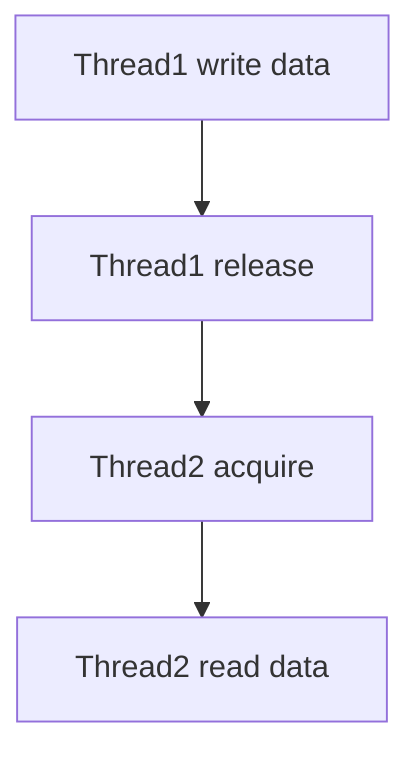

[Anterior](concurrency-and-parallelism.md) | [Índice](../../SUMMARY.md) | [Próximo](synchronization-primitives-and-contention.md)

# Memory Model & Atomics — Visibilidade, Ordem e Happens-Before (Nível Sênior)

## Visão Geral e Contexto de Mercado

Grande parte dos bugs de concorrencia nao vem de "duas threads mexendo na mesma variavel" (isso e o sintoma), mas de algo mais sutil:

- **Visibilidade**: um thread nao enxerga a escrita do outro no tempo esperado.
- **Ordem**: o compilador/CPU reordena operacoes mantendo semantica single-thread, mas quebrando suposicoes multi-thread.
- **Atomicidade**: uma leitura/escrita pode ser observada de forma "parcial" ou intercalada (dependendo do tipo, alinhamento e runtime).

Em sistemas de mercado, isso aparece como:

- Flags que "nao pegam" (feature toggle, shutdown, cancelamento)
- "Double init" (lazy init que roda duas vezes sob carga)
- Contadores, caches e mapas com valores inconsistentes
- Heisenbugs que somem ao adicionar logs

---

## Glossario (o minimo para conversar bem)

- **Data race**: dois acessos concorrentes ao mesmo endereco, pelo menos um write, sem sincronizacao.
- **Happens-before (HB)**: relacao que garante visibilidade e ordenacao entre operacoes.
- **Atomic**: operacao indivisivel (para aquele tipo/operacao).
- **Acquire/Release**: modelo comum de memoria para publicar dados com seguranca.
- **Fence/Barrier**: instrucao/efeito que restringe reordenacao.

---

## Modelo Mental

### A intuicao certa

Pense em cada thread como se ele tivesse um "caderno" (cache/registros) e o mundo real (memoria) como um quadro. Sem regras de sincronizacao, cada um pode ver um quadro diferente por algum tempo.

### Happens-before em uma figura

Se existe HB de A para B, entao efeitos de A sao visiveis em B.



---

## Principios praticos

### 1) Data race e bug, mesmo se "parece funcionar"

Sem um sincronizador (lock, channel send/receive, await com garantias, atomic com semantica correta), o comportamento pode variar por:

- CPU (x86 vs ARM)
- Otimizacao do compilador
- Versao do runtime
- Carga/temperatura/afinidade

### 2) "Atomic" nao significa "thread-safe" automaticamente

Atomics resolvem alguns problemas (ex.: contador), mas nao substituem invariantes compostas.

Exemplo de invariantes compostas (precisa de lock/estrategia):

- "Se state = Published, entao payload != null" (duas variaveis)
- "map e entries precisam ser consistentes"

### 3) Publish/Subscribe seguro (padrao acquire/release)

O padrao "publicar dados" em geral e:

- Escritor prepara dados
- Escritor faz **release** ao publicar ponteiro/estado
- Leitor faz **acquire** ao observar ponteiro/estado
- Leitor consome dados com seguranca

---

## Exemplos (conceituais, multiplas linguagens)

### Go: o que resolve happens-before

Em Go, **comunicacao por channel** cria ordem/visibilidade entre goroutines.

```go
// Enviar em ch acontece-before receber em ch.
ch <- value
v := <-ch
```

Tambem existem atomics (`sync/atomic`) e locks (`sync.Mutex`).

### C#/.NET: volatile e Interlocked

- `volatile` ajuda com visibilidade (nao substitui lock para invariantes compostas)
- `Interlocked` fornece operacoes atomicas (increment, exchange, compare-exchange)

### Python: cuidado com ilusoes

- O GIL nao transforma invariantes em thread-safe.
- Operacoes compostas (read-modify-write) continuam vulneraveis.

---

## Armadilhas classicas

- **Double-checked locking** mal implementado
- **Flag de cancelamento** sem visibilidade (loop que nunca para)
- **Lazy init** sem sincronizacao
- **Relaxed atomics** usados sem modelagem (C/C++)

---

## Testabilidade e Diagnostico

- Prefira detectar data races em CI quando a linguagem suporta (ex.: Go `-race`).
- Evite testes com `sleep` como prova de corretude.
- Modele invariantes e force interleavings com stress/repeticao.

---

## Referencias e Leituras Recomendadas

- Go Memory Model (documentacao oficial)
- Java/.NET memory model (visibilidade, volatile)
- Concurrency in Practice (conceitos de HB e patterns)

---

[Anterior](concurrency-and-parallelism.md) | [Índice](../../SUMMARY.md) | [Próximo](synchronization-primitives-and-contention.md)
