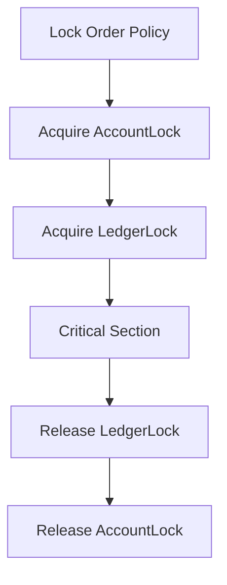

[Anterior](memory-model-and-atomics.md) | [Índice](../../SUMMARY.md) | [Próximo](classic-concurrency-problems.md)

# Primitivas de Sincronizacao & Contencao — Locks, Semaforos e Condicoes (Nível Sênior)

## Visão Geral e Contexto de Mercado

Depois de entender memory model, o proximo salto e escolher **primitivas** e **disciplinas de locking** que mantenham corretude sem matar throughput.

Em producao, o problema raramente e "preciso de um mutex". E mais comum:

- lock global vira gargalo (p99 piora em pico)
- deadlock por ordem de locks inconsistente
- starvation/fairness ruim
- thundering herd por condition mal usada

---

## Primitivas (o que sao e quando usar)

- **Mutex**: exclusao mutua, bom para secoes pequenas.
- **RWLock**: muitos readers, poucos writers (cuidado com starvation).
- **Semaphore**: limita concorrencia (ex.: no maximo N IOs simultaneos).
- **Condition variable**: esperar condicao sem busy-wait.
- **Barrier/Latch**: coordenar fases (ex.: start simultaneo em testes).
- **Channels/Queues**: sincronizacao via passagem de mensagens.

---

## Disciplina de Locking (o que senior documenta)

### Ordem de locks (prevencao de deadlock)

Defina uma ordem global de aquisicao. Exemplo: `AccountLock` antes de `LedgerLock`.



### Granularidade

- **Coarse-grained**: mais simples, menos paralelo.
- **Fine-grained**: mais paralelo, mais risco de deadlock e complexidade.

Uma estrategia comum e **lock striping** (sharding de locks por chave).

### Timeouts e degradacao

Em sistemas criticos, bloquear indefinidamente e uma escolha perigosa.

- Use timeouts para aquisicao de lock quando fizer sentido.
- Quando falhar, degrade com resposta controlada (retry, 409, fila, circuit breaker).

---

## Contencao e Performance

### Sintomas comuns

- p99 cresce com QPS
- CPU sobe mas throughput nao
- threads bloqueadas (many WAITING)
- filas internas crescem

### Efeitos conhecidos

- **Convoying**: uma thread lenta segura lock e empilha todo mundo.
- **Priority inversion**: thread de baixa prioridade segura recurso.
- **False sharing**: duas variaveis em mesma cache line causam ping-pong.

### Observabilidade recomendada

- Tempo de espera por lock (histogram)
- Taxa de falha por timeout ao adquirir lock
- Tamanho/lag de filas internas

---

## Exemplos

### C#: limitar concorrencia com SemaphoreSlim

```csharp
using System;
using System.Threading;
using System.Threading.Tasks;

public sealed class BoundedParallelism
{
    private readonly SemaphoreSlim _gate;
    public BoundedParallelism(int maxConcurrency) => _gate = new SemaphoreSlim(maxConcurrency);

    public async Task RunAsync(Func<Task> job)
    {
        await _gate.WaitAsync().ConfigureAwait(false);
        try { await job().ConfigureAwait(false); }
        finally { _gate.Release(); }
    }
}
```

### Go: condition variable (padrao producer/consumer)

```go
var mu sync.Mutex
var cond = sync.NewCond(&mu)
var ready bool

func WaitReady() {
    mu.Lock()
    for !ready {
        cond.Wait()
    }
    mu.Unlock()
}

func SetReady() {
    mu.Lock()
    ready = true
    cond.Broadcast()
    mu.Unlock()
}
```

### Python: Condition para coordenacao

```python
import threading

cond = threading.Condition()
ready = False

def waiter():
    global ready
    with cond:
        while not ready:
            cond.wait()

def setter():
    global ready
    with cond:
        ready = True
        cond.notify_all()
```

---

## Armadilhas

- Notificar sem proteger invariantes (condition sem while)
- RWLock aplicado onde writes sao frequentes
- Semaforo usado como mutex (ou vice-versa) sem explicitar intencao
- Lock em path de IO lento (segura lock enquanto chama rede)

---

## Referencias

- The Little Book of Semaphores (padroes classicos)
- Documentacao de primitives (Go sync, .NET threading)

---

[Anterior](memory-model-and-atomics.md) | [Índice](../../SUMMARY.md) | [Próximo](classic-concurrency-problems.md)
