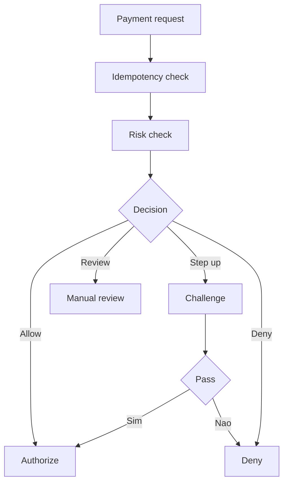
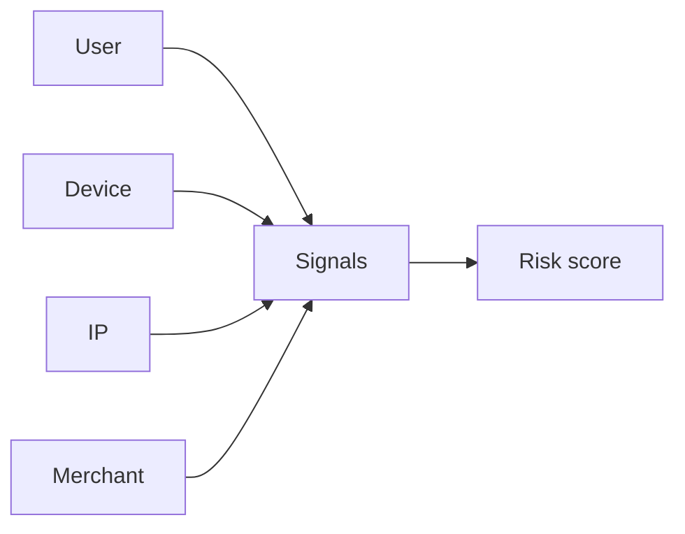

[Anterior](idempotency-keys-and-dedup.md) | [Índice](../../SUMMARY.md) | [Próximo](sagas-for-payments.md)

# Antifraude em Pagamentos — Risk Checks, Step Up e Revisao Manual

## Visao Geral e Contexto de Mercado

Em pagamentos, antifraude e uma camada de decisao que tenta bloquear perdas (fraude, chargeback) sem destruir conversao.
Na pratica, antifraude aparece como:

- **Risk checks sincronos** no caminho de autorizacao (precisa ser rapido)
- **Risk checks assincronos** depois do evento (monitoramento, investigacao)
- **Step up** (desafio adicional) quando risco e incerto
- **Revisao manual** para casos de maior impacto

O ponto senior e projetar isso como um sistema critico: deterministico onde precisa, auditavel, idempotente e observavel.

---

## Fundamentos, Evolucao e Padroes de Mercado

- **Rule engine + modelo**
	- Regras deterministicas para casos obvios (listas, limites, velocity).
	- Modelo de ML para sinal mais fino e adaptacao.

- **Decisoes tipicas**
	- **Allow**: segue o fluxo.
	- **Deny**: bloqueia.
	- **Review**: cria caso para analise.
	- **Step up**: exige desafio (ex.: 3DS, OTP, device check).

- **Reason codes e trilha de auditoria**
	- Toda decisao precisa de justificativa e correlacao com a operacao.

---

## Diagramas e Intuicao Visual

### Onde antifraude entra



### Sinais comuns



---

## Principais Desafios no Uso Profissional

- **Latencia vs qualidade**
	No caminho sincrono, cada ms importa.

- **Falso positivo**
	Bloquear bom cliente custa conversao e reputacao.

- **Adversarial behavior**
	Fraudadores adaptam rapidamente.

- **Feedback e rotulo**
	Chargeback chega dias depois; o rotulo e atrasado e incompleto.

- **Dados sensiveis e compliance**
	PII e risco; minimize, proteja e audite acesso.

---

## Estrategias Avancadas e Decisoes Arquiteturais

- **Contract por operacao**
	Antifraude deve receber um `payment_id` estavel e retornar `decision_id`.

- **Idempotencia por avaliacao**
	Uma mesma operacao nao pode gerar decisoes diferentes em retry.

- **Shadow mode e rollout**
	Rode modelos em paralelo sem afetar decisao (so log), compare contra baseline.

- **Separar decisao de execucao**
	Decidir e registrar e uma coisa; executar (deny, step up) e outra.

- **Motivos explicaveis**
	Mesmo com ML, sempre produza reason codes.

- **Observabilidade**
	Meça allow, deny, review, step up, e tambem chargeback rate por segmento.

---

## Exemplos Avancados (Python, C# e Go)

### Pseudocodigo de avaliacao

```text
risk_check(payment)
  if payment_id already evaluated return stored decision
  score = model(payment.features)
  if rule_blacklist hit return deny
  if score >= deny_threshold return deny
  if score >= stepup_threshold return step_up
  if score >= review_threshold return review
  return allow
```

### Python — avaliacao deterministica simples

```python
from dataclasses import dataclass

@dataclass(frozen=True)
class Decision:
	kind: str
	reasons: list[str]

def decide(amount_cents: int, velocity_1m: int, ip_reputation: str) -> Decision:
	reasons: list[str] = []
	if ip_reputation == "bad":
		return Decision("deny", ["ip_reputation_bad"])
	if velocity_1m > 20:
		reasons.append("high_velocity")
		return Decision("step_up", reasons)
	if amount_cents > 200_000:
		reasons.append("high_amount")
		return Decision("review", reasons)
	return Decision("allow", ["baseline"])
```

---

## Boas Praticas Seniores e Armadilhas

- Nao misture antifraude com regra de negocio no mesmo modulo.
- Nao deixe a decisao virar um "if else" sem reason codes.
- Nao trate "deny" como unico controle; step up e review tem valor.
- Sempre planeje reconciliacao: a verdade final pode vir depois (chargeback).

[Anterior](idempotency-keys-and-dedup.md) | [Índice](../../SUMMARY.md) | [Próximo](sagas-for-payments.md)
