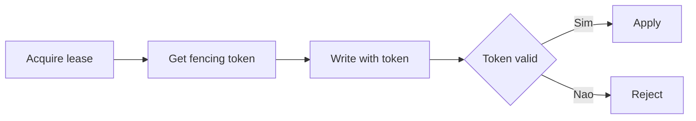

[Anterior](transactional-outbox-and-cdc.md) | [Índice](../../SUMMARY.md) | [Próximo](reconciliation-and-auditability.md)

# Distributed Locks — Leases, Fencing Tokens e Leader Election

## Visao Geral e Contexto de Mercado

Locks distribuidos aparecem quando voce precisa garantir "um por vez":

- Capturar pagamento uma unica vez
- Rodar settlement por janela de tempo
- Processar fila por particao

O risco e alto: lock errado vira split brain e efeito duplicado.

---

## Fundamentos, Evolucao e Padroes de Mercado

- **Lease**
	Lock com expiracao; evita lock infinito.

- **Fencing token**
	Um numero monotonicamente crescente que protege o recurso.
	Mesmo se o lock expirar, token velho nao pode escrever.

- **Leader election**
	Escolhe um lider para uma tarefa (ex.: cron).

---

## Diagramas e Intuicao Visual

---

## Principais Desafios no Uso Profissional

- Clock e expiracao
- Latencia e GC pauses
- Rede particionada

---

## Estrategias Avancadas e Decisoes Arquiteturais

- Prefira "single writer per key" quando o dominio permite.
- Se usar lock, use lease e fencing token.
- Use storage que suporte atomicidade para lock (ex.: Redis scripts).

---

## Boas Praticas Seniores e Armadilhas

- Lock sem fencing nao protege contra split brain.
- Nao use TTL pequeno sem renovacao segura.
- Trate renovacao como operacao critica e monitore.

[Anterior](transactional-outbox-and-cdc.md) | [Índice](../../SUMMARY.md) | [Próximo](reconciliation-and-auditability.md)
