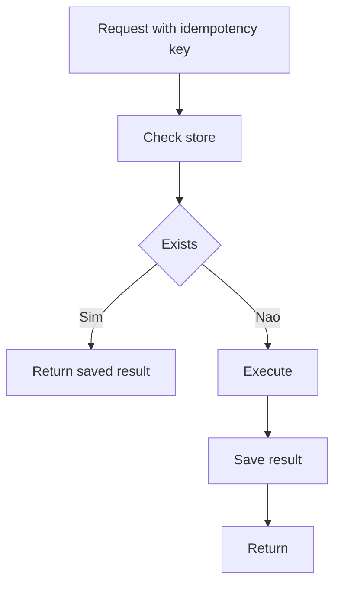

[Anterior](payment-ledgers-and-double-entry.md) | [Índice](../../SUMMARY.md) | [Próximo](antifraud-risk-checks-and-step-up.md)

# Idempotencia em Pagamentos — Idempotency Key, Dedup e Retries

## Visao Geral e Contexto de Mercado

Em pagamentos, retries sao inevitaveis:

- Cliente repete request por timeout
- Gateway repete callback
- Worker reprocessa mensagem

Sem idempotencia, o mesmo comando pode gerar cobranca duplicada.

---

## Fundamentos, Evolucao e Padroes de Mercado

- **Idempotency key**
	Cliente envia uma chave unica por operacao logica.

- **Dedup store**
	Servidor persiste resultado por chave e retorna o mesmo resultado em retries.

- **At least once delivery**
	Mensageria e callbacks tendem a entregar pelo menos uma vez.

---

## Diagramas e Intuicao Visual



---

## Principais Desafios no Uso Profissional

- **Concorrencia**
	Dois requests com mesma chave ao mesmo tempo.

- **Escopo**
	Key por usuario? por merchant? por endpoint? defina contrato.

- **Retencao**
	Quanto tempo manter a chave para cobrir retries.

---

## Estrategias Avancadas e Decisoes Arquiteturais

- Use uma tabela com `unique` em `(scope, idempotency_key)`.
- Salve um "status" intermediario (in progress) para bloquear concorrencia.
- Retorne o mesmo response body e status code no retry.
- Para callbacks, dedup por `provider_event_id`.

---

## Exemplos Avancados (Python, C# e Go)

### SQL pattern

```text
begin
  insert into idempotency(scope, key, status) values (...) on conflict do nothing
  if row already exists then
    return stored_response
  else
    execute business logic
    update idempotency set stored_response = ...
commit
```

---

## Boas Praticas Seniores e Armadilhas

- Nao use apenas cache para idempotencia; use storage duravel.
- Nao use key opcional em operacoes de dinheiro.
- Trate retry com backoff e limites.

[Anterior](payment-ledgers-and-double-entry.md) | [Índice](../../SUMMARY.md) | [Próximo](antifraud-risk-checks-and-step-up.md)
