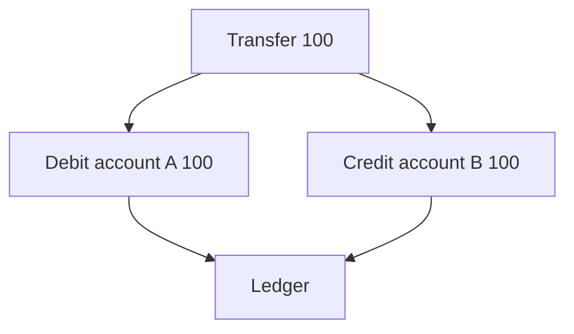

[Anterior](payments-fintech-overview.md) | [Índice](../../SUMMARY.md) | [Próximo](idempotency-keys-and-dedup.md)

# Payment Ledgers — Double Entry, Imutabilidade e Fonte de Verdade

## Visao Geral e Contexto de Mercado

Em pagamentos, "saldo" nao deveria ser um numero que voce atualiza com `+` e `-`.
O padrao de mercado e um **ledger** (livro razao) com **double entry**:

- Cada movimento gera dois lancamentos: debit e credit
- O ledger e imutavel: voce adiciona entradas, nao edita o passado
- Saldos sao derivados por agregacao (eventualmente com snapshots)

Isso melhora auditoria, reconciliação e recuperacao.

Na pratica, um ledger bem feito permite:

- Reprocessar eventos sem mudar o passado
- Explicar discrepancias (por que o saldo mudou)
- Fazer reconciliacao com provider e banco
- Aplicar ajustes com trilha de auditoria

---

## Fundamentos, Evolucao e Padroes de Mercado

- **Double entry**
	- Para cada movimento: soma dos debitos = soma dos creditos.
	- Ajuda a detectar bugs e inconsistencias.

- **Imutabilidade**
	- Corrigir erro vira um novo lancamento de ajuste.

- **Id de correlacao**
	- Cada evento financeiro tem um id unico para trace e dedup.

- **Chart of accounts (contas do sistema)**
	- Contas de cliente, fees, clearing, settlement, chargeback.
	- Separar contas evita saldo magico e facilita auditoria.

---

## Diagramas e Intuicao Visual

### Double entry simplificado



---

## Principais Desafios no Uso Profissional

- **Modelagem de contas**
	Conta de cliente, conta de fees, conta de clearing, conta de settlement.

- **Moeda e arredondamento**
	Dinheiro exige inteiro em menor unidade e regras de rounding.

- **Performance de agregacao**
	Saldos por conta podem exigir indexacao e snapshots.

- **Concorrencia e ordem**
	Lancamentos chegam com retries e fora de ordem; a modelagem precisa suportar isso.

- **Auditoria e trilha**
	Sem reason codes e ids estaveis, voce nao explica ajustes e disputas.

---

## Estrategias Avancadas e Decisoes Arquiteturais

- Use ids estaveis: `transaction_id`, `payment_id`, `idempotency_key`.
- Separe ledger de "projecoes" (read models) para consultas rapidas.
- Use constraints para reforcar invariantes (ex.: balanceado por transaction).

### Esquema minimo (exemplo)

Um schema tipico (simplificado) para discutir invariantes:

```sql
create table ledger_entries (
	id bigserial primary key,
	ledger_tx_id uuid not null,
	account_id uuid not null,
	direction text not null, -- debit or credit
	amount_cents bigint not null,
	currency text not null,
	payment_id uuid null,
	created_at timestamptz not null default now()
);

create index ix_ledger_account_time on ledger_entries(account_id, created_at);
create index ix_ledger_tx on ledger_entries(ledger_tx_id);
```

Para garantir double entry, voce normalmente valida antes do commit e tambem cria rotinas de auditoria (jobs) para detectar violacoes.

### Projecoes e snapshots

- Projecao: tabela materializada por conta com saldo atual.
- Snapshot: checkpoints para acelerar soma historica.
- Regra: ledger e fonte de verdade; projecoes sao derivadas e reconstruiveis.

### Ajustes e correcao

- Ajuste nao e update no passado. E um novo lancamento com motivo e correlacao.
- Em auditoria, voce precisa responder: quem, quando, por que, com qual evidenca.

---

## Exemplos Avancados (Python, C# e Go)

### Pseudocodigo de lancamento

```text
post_transfer(tx_id, from, to, amount)
  insert ledger_entry(tx_id, account=from, kind=debit, amount)
  insert ledger_entry(tx_id, account=to,   kind=credit, amount)
  assert sum(tx_id, debit) == sum(tx_id, credit)
```

---

## Boas Praticas Seniores e Armadilhas

- Nao atualize saldo em linha como fonte de verdade sem trilha de auditoria.
- Nao use float para dinheiro.
- Trate estorno e chargeback como novos movimentos.

---

## FAQ Especialista

**Por que double entry importa mesmo em produto digital?**  
Porque ele cria uma propriedade simples para detectar inconsistencias e reduz discussao subjetiva em incidentes.

**Saldo materializado e anti-pattern?**  
Nao, desde que seja derivado e reconstruivel. O anti-pattern e tratar o saldo materializado como fonte de verdade.

[Anterior](payments-fintech-overview.md) | [Índice](../../SUMMARY.md) | [Próximo](idempotency-keys-and-dedup.md)
