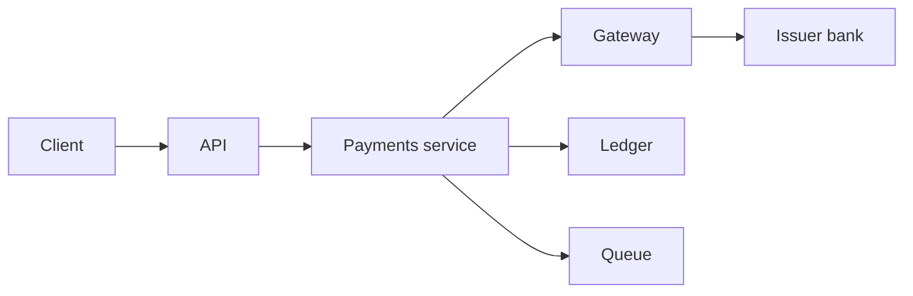
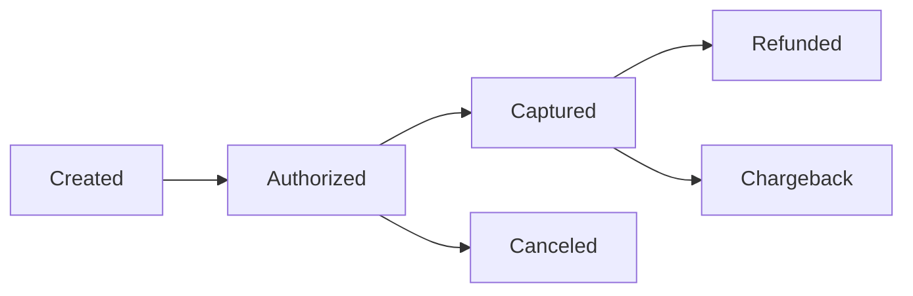

[Anterior](db-concurrency-control.md) | [Índice](../../SUMMARY.md) | [Próximo](payment-ledgers-and-double-entry.md)

# Operacoes Criticas em Pagamentos e Fintech — Visao Geral

## Visao Geral e Contexto de Mercado

Pagamentos e fintech sao dominios onde pequenas inconsistencias viram dinheiro perdido, chargeback, fraude, ou problemas regulatorio e de auditoria.

Aqui, operacao critica normalmente significa:

- Efeito financeiro irreversivel (captura, estorno, settlement)
- Mudanca de estado que nao pode "voltar" sem registro (ledger)
- Workflows distribuidos com retries (gateway, antifraude, banco, mensageria)

O objetivo e garantir **corretude**, **idempotencia**, **auditoria** e **recuperacao**.

Um bom norte para documentacao senior e separar claramente:

- **Comando** (o que voce tenta fazer: autorizar, capturar)
- **Efeito** (o que foi aplicado: lancamento no ledger, evento publicado)
- **Prova** (como auditar: ids, reason codes, trilha e reconciliacao)

---

## Fundamentos, Evolucao e Padroes de Mercado

### Terminologia pratica

- **Authorization**: reserva limite no emissor. Pode expirar.
- **Capture**: efetiva a cobranca.
- **Refund**: estorno iniciado pelo merchant.
- **Chargeback**: disputa iniciada pelo portador/banco.
- **Settlement**: liquidacao e conciliacao com adquirente/gateway.

Em sistemas reais, esses estados tem latencia e falhas diferentes. Nao modele tudo como um unico "status".

- **Ledger e double entry**
	Fonte de verdade imutavel de movimentos.

- **Idempotencia e dedup**
	Requisito para retries seguros.

- **Sagas e compensacao**
	Quando o fluxo cruza servicos e nao cabe em uma transacao unica.

- **Outbox e CDC**
	Publicacao confiavel de eventos a partir do commit no banco.

- **Reconciliação**
	Compara fontes (provedor, banco, ledger) e fecha gaps.

---

## Diagramas e Intuicao Visual

### High level payment flow

### Estados tipicos de um pagamento

---

## Principais Desafios no Uso Profissional

- Reexecucao de requests (timeout, retry do cliente, retry do gateway)
- Concorrencia e duplicidade (double spend, race conditions)
- Observabilidade e auditoria ponta a ponta
- Falhas parciais e consistencia eventual

- Modelagem de estados e transicoes
	Sem state machine explicita, voce cria estados ambiguos (ex.: pending eterno).

- Separacao de fonte de verdade
	Provider e fonte externa. Seu ledger e a fonte do seu sistema.

---

## Estrategias Avancadas e Decisoes Arquiteturais

- Defina invariantes do dominio (ex.: saldo nunca negativo, capturar uma vez).
- Trate idempotencia como parte do contrato da API.
- Use ledger imutavel e derive saldos via agregacao.
- Publique eventos via outbox para nao perder efeitos.
- Reconciliacao e rotina: deteccao e correcao controlada.

### Invariantes que normalmente precisam existir

- At most once capture por `payment_id`.
- Saldo derivado do ledger (nunca float).
- Double entry balanceado por `ledger_tx_id`.
- Idempotencia obrigatoria em comandos de dinheiro.
- Cada efeito financeiro tem um id estavel (para dedup e auditoria).

### Modelo de dados minimo (alto nivel)

Nao e um schema completo, mas um mapa mental de tabelas comuns:

- `payments`: estado do pagamento (state machine, valores, ids externos).
- `payment_attempts`: tentativas e integracao com gateway (inclui erros, latencia).
- `ledger_entries`: lancamentos (imutavel) com `ledger_tx_id`.
- `idempotency_keys`: dedup de requests e callbacks.
- `outbox`: eventos a publicar (para integracao confiavel).

Se voce so tem `payments(status)` e logs, voce esta no caminho de incidentes.

### Falhas comuns e como desenhar para elas

- Timeout antes de saber o resultado: trate como estado unknown e reconcilie.
- Callback duplicado: dedup por `provider_event_id`.
- Callback fora de ordem: valide transicoes permitidas.
- Retry de worker: consumidor idempotente por `event_id`.

### Observabilidade e operacao

- Logs com `payment_id`, `idempotency_key`, `provider_payment_id`, `ledger_tx_id`.
- Tracing ponta a ponta (propagar correlation ids).
- Metricar: autorizacoes, capturas, refunds, chargebacks, e lag de outbox.

---

## Boas Praticas Seniores e Armadilhas

- Nao dependa apenas de "status" de provider como fonte de verdade.
- Nao use apenas logs como auditoria; use ledger.
- Evite estados ambiguos; modele estados explicitamente.

---

## FAQ Especialista

**Por que nao confiar apenas no status do gateway?**  
Porque voce precisa de auditabilidade e correcoes controladas. Provider pode ter atrasos, duplicidades e inconsistencias de integracao.

**O que e exactly once em pagamentos na pratica?**  
Normalmente significa: comandos e consumidores idempotentes, dedup por ids estaveis, e reconciliacao para estados unknown.

[Anterior](db-concurrency-control.md) | [Índice](../../SUMMARY.md) | [Próximo](payment-ledgers-and-double-entry.md)
