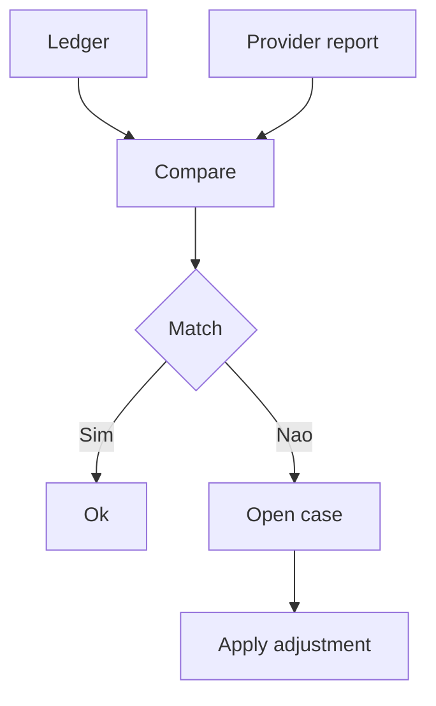

[Anterior](distributed-locks-leases-fencing.md) | [Índice](../../SUMMARY.md) | [Próximo](../events-and-queues/queues-and-messaging.md)

# Reconciliation & Auditabilidade — Fechar Gaps sem Duplicar Efeitos

## Visao Geral e Contexto de Mercado

Mesmo com boas praticas, pagamentos tem estados "presos":

- Gateway respondeu mas o callback nao chegou
- Evento publicado mas consumidor falhou
- Discrepancia entre provider e ledger

Reconciliacao e o processo de comparar fontes e aplicar correcao controlada.

---

## Fundamentos, Evolucao e Padroes de Mercado

- **Fonte de verdade**
	Ledger e a fonte do seu sistema.
	Provider e uma fonte externa que precisa ser reconciliada.

- **Jobs de reconciliacao**
	Rotina que cruza dados e sinaliza divergencias.

- **Ajustes**
	Quando necessario, gera lancamentos de ajuste no ledger.

---

## Diagramas e Intuicao Visual

---

## Principais Desafios no Uso Profissional

- **Idempotencia**
	A reconciliacao nao pode gerar efeitos duplicados.

- **Escala**
	Relatorios diarios e grandes volumes exigem batch eficiente.

- **Auditoria**
	Cada ajuste precisa de trilha: quem, quando, por que.

---

## Estrategias Avancadas e Decisoes Arquiteturais

- Trabalhe com estados explicitos e janelas de tempo.
- Use correlacao por ids (payment id, provider id, event id).
- Tenha um workflow de "case" com aprovacao para ajustes sensiveis.

---

## Boas Praticas Seniores e Armadilhas

- Nao corrija com update direto; use novos lancamentos.
- Nao faca reconciliacao sem observabilidade (lag, backlog, taxa de divergencia).
- Planeje reprocessamento seguro (dedup, replay).

[Anterior](distributed-locks-leases-fencing.md) | [Índice](../../SUMMARY.md) | [Próximo](../events-and-queues/queues-and-messaging.md)
