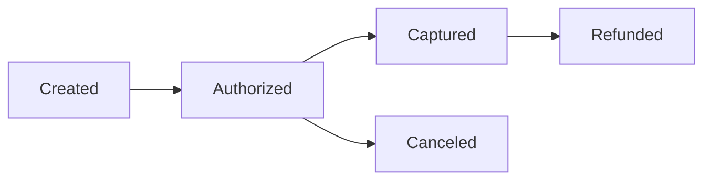

[Anterior](antifraud-risk-checks-and-step-up.md) | [Índice](../../SUMMARY.md) | [Próximo](transactional-outbox-and-cdc.md)

# Sagas em Pagamentos — Orquestracao, Compensacao e Estados

## Visao Geral e Contexto de Mercado

Pagamentos frequentemente cruzam multiplos sistemas:

- Payments service
- Antifraud
- Gateway
- Ledger
- Notification

Nao existe uma transacao ACID unica para tudo. Sagas coordenam etapas com compensacao.

---

## Fundamentos, Evolucao e Padroes de Mercado

- **Orquestracao**
	Um orquestrador comanda etapas e transicoes.

- **Coreografia**
	Servicos reagem a eventos e avancam o fluxo.

- **Compensacao**
	Desfaz o efeito logico (ex.: cancelar autorizacao, estornar).

- **State machine**
	Modela estados e transicoes de forma explicita.

---

## Diagramas e Intuicao Visual

---

## Principais Desafios no Uso Profissional

- **Estados ambiguos**
	Ex.: "pending" sem clareza vira bagunca.

- **Falhas parciais**
	Etapa 3 falha depois de etapa 2 ter sucesso.

- **Idempotencia por etapa**
	Cada comando e callback precisa ser deduplicado.

---

## Estrategias Avancadas e Decisoes Arquiteturais

- Use state machine e transicoes permitidas.
- Registre cada etapa com correlation id.
- Separe comando (write) de projeções (read).
- Planeje compensacao realista: nem tudo compensa perfeitamente.

---

## Boas Praticas Seniores e Armadilhas

- Nao dependa de transacao distribuida para saga.
- Evite coreografia sem contrato claro de eventos.
- Sempre tenha reconciliacao para estados presos.

[Anterior](antifraud-risk-checks-and-step-up.md) | [Índice](../../SUMMARY.md) | [Próximo](transactional-outbox-and-cdc.md)
