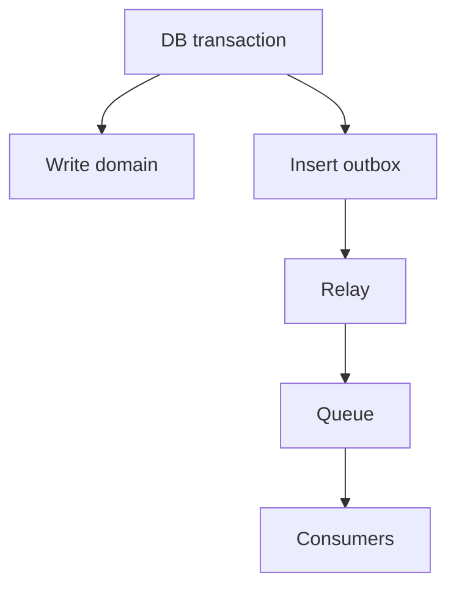

[Anterior](sagas-for-payments.md) | [Índice](../../SUMMARY.md) | [Próximo](distributed-locks-leases-fencing.md)

# Transactional Outbox & CDC — Publicacao Confiavel de Eventos

## Visao Geral e Contexto de Mercado

Em pagamentos, voce nao pode perder eventos:

- Payment captured
- Refund issued
- Chargeback received

O problema classico: escrever no banco e publicar em fila sao dois sistemas.
Se um falhar, voce fica inconsistente.

O outbox resolve isso: escreve o evento no mesmo commit da mudanca, e um relayer publica depois.

---

## Fundamentos, Evolucao e Padroes de Mercado

- **Transactional outbox**
	Tabela `outbox` no mesmo banco do write.

- **Relay publisher**
	Worker le outbox e publica no broker.

- **CDC**
	Em alguns stacks, Debezium le WAL e publica mudancas.

---

## Diagramas e Intuicao Visual

---

## Principais Desafios no Uso Profissional

- **Ordenacao e duplicidade**
	Broker entrega at least once; consumidores precisam ser idempotentes.

- **Backfill e replay**
	Reprocessar historico sem efeitos duplicados.

- **Observabilidade**
	Lag do outbox e backlog.

---

## Estrategias Avancadas e Decisoes Arquiteturais

- Use id de evento estavel e unique.
- Marque outbox como published de forma atomica.
- Consuma com dedup e idempotencia.
- Para CDC, planeje schema evolution e compatibilidade.

---

## Boas Praticas Seniores e Armadilhas

- Nao publique evento antes do commit.
- Nao confie em exactly once do broker.
- Nao ignore DLQ e reprocessamento.

[Anterior](sagas-for-payments.md) | [Índice](../../SUMMARY.md) | [Próximo](distributed-locks-leases-fencing.md)
