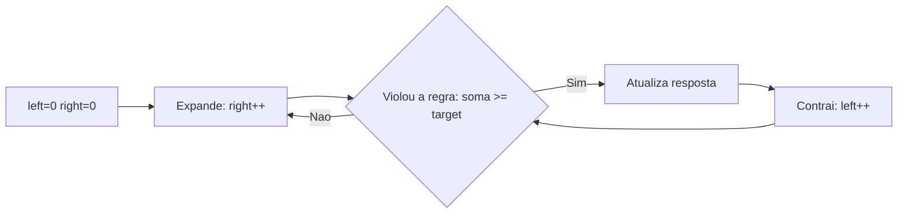
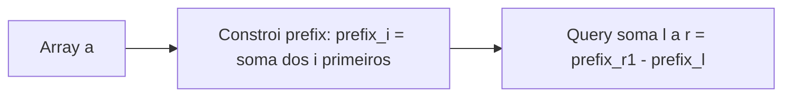
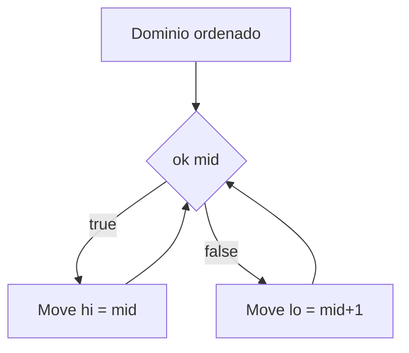

[Anterior](data-structures-algorithms-overview.md) | [Índice](../../SUMMARY.md) | [Próximo](linked-lists.md)

# Arrays & Strings — Padrões de Algoritmos (Nível Sênior)

## Visão Geral e Contexto de Mercado

Arrays (vetores) e strings aparecem em quase todo lugar: payloads JSON, linhas de logs, eventos de streaming, listas de IDs, buffers de rede, resultados de query.
O diferencial sênior é dominar *padrões recorrentes* que transformam problemas em soluções previsíveis e performáticas.

---

## Fundamentos, Evolução e Padrões de Mercado

- **Por que arrays são tão rápidos na prática**
	- Memória contígua → melhor cache locality.
	- Acesso por índice $O(1)$.

- **Padrões clássicos em arrays/strings**
	- **Two pointers** (dois ponteiros)
	- **Sliding window** (janela deslizante)
	- **Prefix sums** (somas prefixadas)
	- **Difference array** (atualizações em intervalo)
	- **Binary search** (busca binária em domínios monotônicos)
	- **Counting** (frequências) e **hashing**

---

## Principais Desafios no Uso Profissional

- **Off-by-one** e bordas (vazio, 1 elemento, duplicados).
- **Unicode/normalização** em strings (principalmente em validação e busca).
- **Cópias desnecessárias** (slices/substrings) e impacto em memória/GC.

---

## Estratégias Avançadas e Decisões Arquiteturais

- **Escolha o padrão certo**
	- Existe monotonicidade? → busca binária.
	- Precisa de “melhor subarray” sob restrição? → sliding window.
	- Muitas queries de soma em subarrays? → prefix sums.

- **Buscas binárias além de “achar valor”**
	Use busca binária para encontrar o **menor valor** que satisfaz um predicado monotônico (ex.: capacidade mínima, menor taxa, menor tempo).

---

## Diagramas e Intuição Visual

### Sliding Window (janela variável)



### Prefix Sum (consulta em intervalo)



### Binary Search em predicado monotônico



## Algoritmos Essenciais

### 1) Sliding Window (tamanho variável)

Quando a janela expande/contrai mantendo uma propriedade (ex.: soma <= K, número de distintos <= K).

**Complexidade:** $O(n)$

### 2) Prefix Sum

Para obter soma em intervalo $[l, r]$ em $O(1)$ após pré-processamento.

- Pré: $prefix[i] = \sum_{0..i-1} a[i]$
- Query: $sum(l,r) = prefix[r+1] - prefix[l]$

**Complexidade:** build $O(n)$, query $O(1)$

### 3) Binary Search em predicado

Se $f(x)$ é monotônica (false...false, true...true), encontre o menor $x$ com $f(x)=true$.

**Complexidade:** $O(\log R)$ onde $R$ é o tamanho do domínio.

---

## Exemplos Avançados (Python, C# e Go)

### Python — menor subarray com soma >= target (sliding window)

```python
def min_len_subarray_at_least(target: int, nums: list[int]) -> int:
	left = 0
	sum_ = 0
	best = float("inf")

	for right, x in enumerate(nums):
		sum_ += x
		while sum_ >= target:
			best = min(best, right - left + 1)
			sum_ -= nums[left]
			left += 1

	return 0 if best == float("inf") else int(best)
```

### C# — prefix sum para queries de intervalo

```csharp
public static class PrefixSum
{
	public static long[] Build(long[] a)
	{
		var p = new long[a.Length + 1];
		for (int i = 0; i < a.Length; i++) p[i + 1] = p[i] + a[i];
		return p;
	}

	public static long RangeSum(long[] prefix, int l, int r)
		=> prefix[r + 1] - prefix[l];
}
```

### Go — busca binária no menor x que satisfaz predicado monotônico

```go
func LowerBound(lo, hi int, ok func(int) bool) int {
	// retorna o menor x em [lo, hi] tal que ok(x)==true.
	for lo < hi {
		mid := lo + (hi-lo)/2
		if ok(mid) {
			hi = mid
		} else {
			lo = mid + 1
		}
	}
	return lo
}
```

---

## Boas Práticas Sêniores e Armadilhas

- Confirme hipóteses do algoritmo (ex.: sliding window com soma exige números não-negativos; caso contrário, precisa outra abordagem).
- Valide bordas: vazio, 1 elemento, rótulos repetidos, overflow (C#/Go com `int`).
- Em strings, defina: case-sensitive? Unicode normalization? acentos?

---

## Integração na Arquitetura Real

- **Rate limiting / quotas**: janelas deslizantes e contadores por minuto.
- **Observabilidade**: aggregates por intervalo (prefix sums / diferença) para séries temporais.
- **Streaming**: “windowing” (conceito similar) em eventos.

---

## Métricas, Monitoramento e Melhoria Contínua

- Tamanho de input ($n$) por endpoint.
- p95/p99 de parsing/filtragem de arrays grandes.
- Taxa de alocação e cópias (especialmente em strings).

---

## Recursos Avançados e Leituras Recomendadas

- Patterns: two pointers, sliding window, prefix sums (coleção de problemas)

---

## FAQ Especialista

**Sliding window sempre funciona?**  
Não. Em geral, requer monotonicidade (ex.: somas não-negativas) para contrair/expandir corretamente.

**Por que usar prefix sum em vez de somar na hora?**  
Porque evita $O(n)$ por query; com muitas queries, vira multiplicador de custo.

[Anterior](data-structures-algorithms-overview.md) | [Índice](../../SUMMARY.md) | [Próximo](linked-lists.md)
