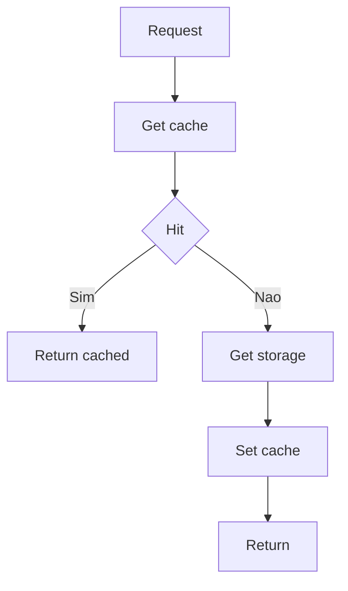
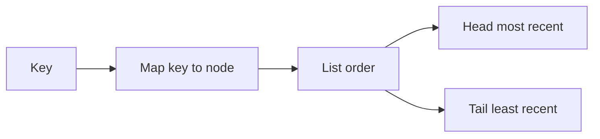

[Anterior](range-queries-fenwick-and-segment-tree.md) | [Índice](../../SUMMARY.md) | [Próximo](consistent-hashing-and-sharding.md)

# Caches & Eviction — LRU, LFU, TTL e Cache Stampede

## Visao Geral e Contexto de Mercado

Cache esta em todo lugar: APIs, gateways, microservicos, CDN, feature flags, rate limiting, pages e resultados de queries.

O valor senior aqui e saber que cache nao e apenas "hash map": voce precisa lidar com:

- Eviction (quando a memoria acaba)
- TTL e staleness (dados velhos)
- Hot keys, thundering herd e cache stampede
- Observabilidade (hit rate, p95, p99, evictions)

---

## Fundamentos, Evolucao e Padroes de Mercado

- **Write through**
	- Escreve no cache e no storage na mesma operacao.
	- Facilita consistencia, mas aumenta latencia de escrita.

- **Write back**
	- Escreve no cache e sincroniza depois.
	- Melhor throughput, mas mais risco de perda em falhas.

- **Cache aside**
	- Aplicacao busca no cache; se miss, busca no storage e popula.
	- Padrao mais comum em backends.

- **Eviction policies**
	- **LRU**: remove o menos recentemente usado.
	- **LFU**: remove o menos frequentemente usado.
	- **TTL only**: remove pelo tempo de vida.
	- Na pratica, sistemas usam variacoes (ex.: TinyLFU, segmented LRU).

---

## Diagramas e Intuicao Visual

### Cache aside



### LRU: hash map mais doubly linked list



---

## Principais Desafios no Uso Profissional

- **Cache stampede**
	Muitos requests em miss ao mesmo tempo geram sobrecarga no storage.

- **Hot keys**
	Poucas chaves dominam o trafego; podem causar contenção e uneven load.

- **Stale data e invalidacao**
	Invalidacao e dificil: TTL reduz o problema, mas nao resolve tudo.

- **Capacidade e limites**
	Sem limite, cache vira vazamento de memoria.

---

## Estrategias Avancadas e Decisoes Arquiteturais

- **Singleflight por chave**
	Quando ha miss, apenas um worker faz load; os outros aguardam.

- **Jitter no TTL**
	Evita expiracao em massa ao mesmo tempo.

- **Negative caching**
	Cacheia "nao existe" por curto tempo para reduzir load.

- **Warmup e prefetch**
	Preaquece chaves importantes antes de eventos (deploy, campanhas).

- **Metrica e SLO**
	Acompanhe hit rate, miss rate, evictions, latency do storage em miss.

---

## Exemplos Avancados (Python, C# e Go)

### Python — LRU simples

```python
from __future__ import annotations

class Node:
	__slots__ = ("k", "v", "prev", "next")
	def __init__(self, k, v):
		self.k = k
		self.v = v
		self.prev = None
		self.next = None

class LRUCache:
	def __init__(self, capacity: int):
		self.capacity = capacity
		self.map = {}
		self.head = Node("head", None)
		self.tail = Node("tail", None)
		self.head.next = self.tail
		self.tail.prev = self.head

	def _remove(self, node: Node) -> None:
		node.prev.next = node.next
		node.next.prev = node.prev

	def _push_front(self, node: Node) -> None:
		node.next = self.head.next
		node.prev = self.head
		self.head.next.prev = node
		self.head.next = node

	def get(self, key):
		node = self.map.get(key)
		if node is None:
			return None
		self._remove(node)
		self._push_front(node)
		return node.v

	def set(self, key, value) -> None:
		node = self.map.get(key)
		if node is not None:
			node.v = value
			self._remove(node)
			self._push_front(node)
			return

		if len(self.map) >= self.capacity:
			lru = self.tail.prev
			self._remove(lru)
			del self.map[lru.k]

		new_node = Node(key, value)
		self.map[key] = new_node
		self._push_front(new_node)
```

### C# — ideia de LRU com LinkedList

```csharp
using System.Collections.Generic;

public sealed class LruCache<TKey, TValue>
{
	private readonly int _cap;
	private readonly Dictionary<TKey, LinkedListNode<(TKey key, TValue value)>> _map;
	private readonly LinkedList<(TKey key, TValue value)> _list;

	public LruCache(int capacity)
	{
		_cap = capacity;
		_map = new Dictionary<TKey, LinkedListNode<(TKey, TValue)>>();
		_list = new LinkedList<(TKey, TValue)>();
	}

	public bool TryGet(TKey key, out TValue value)
	{
		if (!_map.TryGetValue(key, out var node))
		{
			value = default!;
			return false;
		}
		_list.Remove(node);
		_list.AddFirst(node);
		value = node.Value.value;
		return true;
	}

	public void Set(TKey key, TValue value)
	{
		if (_map.TryGetValue(key, out var node))
		{
			node.Value = (key, value);
			_list.Remove(node);
			_list.AddFirst(node);
			return;
		}

		if (_map.Count >= _cap)
		{
			var lru = _list.Last!;
			_map.Remove(lru.Value.key);
			_list.RemoveLast();
		}

		var newNode = new LinkedListNode<(TKey, TValue)>((key, value));
		_list.AddFirst(newNode);
		_map[key] = newNode;
	}
}
```

### Go — singleflight simplificado por chave

```go
package cache

import "sync"

type Group struct {
	mu sync.Mutex
	m  map[string]*call
}

type call struct {
	wg  sync.WaitGroup
	val any
	err error
}

func (g *Group) Do(key string, fn func() (any, error)) (any, error) {
	g.mu.Lock()
	if g.m == nil {
		g.m = make(map[string]*call)
	}
	if c, ok := g.m[key]; ok {
		g.mu.Unlock()
		c.wg.Wait()
		return c.val, c.err
	}
	c := &call{}
	c.wg.Add(1)
	g.m[key] = c
	g.mu.Unlock()

	c.val, c.err = fn()
	c.wg.Done()

	g.mu.Lock()
	delete(g.m, key)
	g.mu.Unlock()
	return c.val, c.err
}
```

---

## Boas Praticas Seniores e Armadilhas

- Defina limites (capacidade, max item size, TTL).
- Use jitter de expiracao para evitar picos.
- Nao ignore invalidacao: escolha um modelo (TTL, eventos, versao).
- Meça hit rate e latencia por caminho (hit vs miss).

[Anterior](range-queries-fenwick-and-segment-tree.md) | [Índice](../../SUMMARY.md) | [Próximo](consistent-hashing-and-sharding.md)
