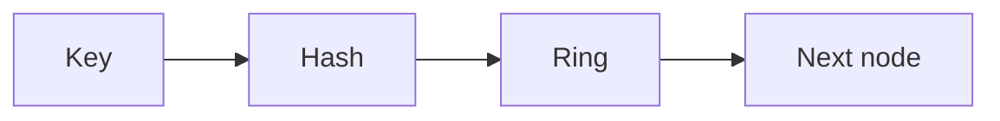

[Anterior](caches-eviction-lru-lfu.md) | [Índice](../../SUMMARY.md) | [Próximo](probabilistic-data-structures.md)

# Consistent Hashing & Sharding — Particionamento com Menos Churn

## Visao Geral e Contexto de Mercado

Quando um sistema precisa escalar horizontalmente, voce quase sempre precisa de uma estrategia de distribuicao:

- Cache distribuido (ex.: Redis cluster, memcached)
- Sharding de banco (por tenant, por id, por hash)
- Balanceamento de carga com afinidade

Consistent hashing e o padrao que minimiza remapeamento quando nodes entram e saem.

---

## Fundamentos, Evolucao e Padroes de Mercado

- **Hash ring**
	- Mapeia o espaco de chaves para um anel de hash.
	- Cada node ocupa pontos no anel.
	- Uma chave vai para o proximo node no sentido horario.

- **Virtual nodes**
	- Cada node real ganha varios pontos no anel.
	- Reduz skew e melhora rebalanceamento.

- **Replication e quorum**
	- Para disponibilidade, uma chave pode ser replicada em N nodes.
	- Quorum decide leitura e escrita em cenarios distribuidos.

---

## Diagramas e Intuicao Visual



---

## Principais Desafios no Uso Profissional

- **Skew**
	Alguns nodes recebem mais chaves que outros.

- **Resharding**
	Mudanca de numero de nodes exige movimentar dados.

- **Hot keys**
	Mesmo com bom hash, uma chave popular pode virar gargalo.

- **Observabilidade**
	Sem metricas por shard, voce nao ve o desequilibrio.

---

## Estrategias Avancadas e Decisoes Arquiteturais

- **Escolha de chave de shard**
	- Evite keys com baixa cardinalidade.
	- Em multi tenant, avalie shard por tenant id.

- **Virtual nodes e pesos**
	- Use mais vnodes para nodes maiores.

- **Backfill com throttling**
	- Rebalancear sem derrubar o sistema.

- **Mitigar hot keys**
	- Key salting (com cuidado)
	- Cache de segundo nivel
	- Partition por tempo ou por prefixo

---

## Exemplos Avancados (Python, C# e Go)

### Python — consistent hashing com vnodes

```python
import bisect
import hashlib

class Ring:
	def __init__(self, replicas: int = 50):
		self.replicas = replicas
		self.points = []  # list of (hash_int, node_id)

	def _h(self, s: str) -> int:
		return int(hashlib.md5(s.encode("utf-8")).hexdigest(), 16)

	def add_node(self, node_id: str) -> None:
		for i in range(self.replicas):
			h = self._h(f"{node_id}:{i}")
			bisect.insort(self.points, (h, node_id))

	def get_node(self, key: str) -> str:
		h = self._h(key)
		idx = bisect.bisect_left(self.points, (h, ""))
		if idx == len(self.points):
			idx = 0
		return self.points[idx][1]
```

---

## Boas Praticas Seniores e Armadilhas

- Consistent hashing resolve churn, mas nao resolve hot key.
- Use virtual nodes para reduzir skew.
- Trate resharding como operacao critica: limite taxa e monitore.

[Anterior](caches-eviction-lru-lfu.md) | [Índice](../../SUMMARY.md) | [Próximo](probabilistic-data-structures.md)
