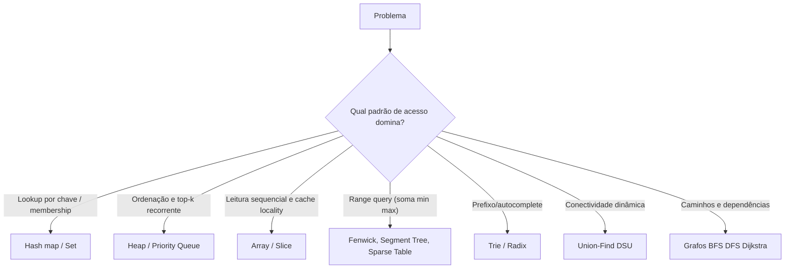
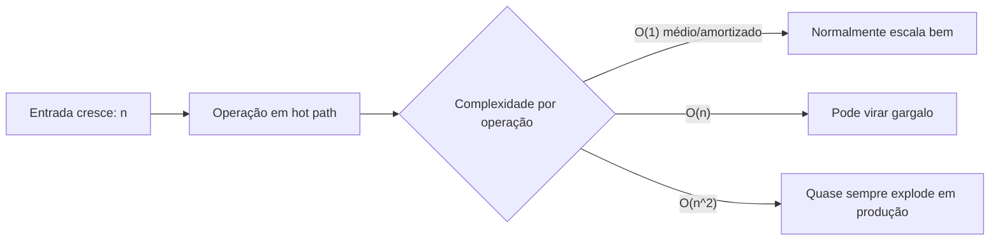

[Anterior](../complexity/data-structures-and-big-o.md) | [Índice](../../SUMMARY.md) | [Próximo](arrays-and-strings.md)

# Estruturas de Dados & Algoritmos — Visão Geral Aplicada (Nível Sênior)

## Visão Geral e Contexto de Mercado

Estruturas de dados e algoritmos não são “tema de entrevista”: são **ferramentas de modelagem de performance e custo**.
Na prática (APIs, batch, streaming, sistemas distribuídos), o maior valor aparece quando você:

- Reduz o custo de operações **quentes** (hot paths) e evita degradação conforme $n$ cresce.
- Escolhe a estrutura de dados que **bate com o padrão de acesso** (lookup, inserção, range query, top-k, ordenação, agregação).
- Protege invariantes com testes (unit/property) e monitora regressões em produção (p95/p99, alocações, GC, CPU).

A regra de ouro em produção: **otimize a estrutura do problema antes de micro-otimizar código**.

---

## Fundamentos, Evolução e Padrões de Mercado

- **Modelos de complexidade que importam**
	- $O(1)$ (médio/amortizado), $O(\log n)$, $O(n)$, $O(n \log n)$, $O(n^2)$.
	- Pior caso vs médio vs amortizado: mapas/hash normalmente são $O(1)$ *médio*, mas podem degradar.

- **Padrões de acesso (o que realmente decide a estrutura)**
	- **Lookup por chave**: hash map / set.
	- **Ordenação e top-k**: heap (priority queue), sort + two pointers.
	- **Range query / prefix sums**: Fenwick (BIT), segment tree, sparse table.
	- **Busca por prefixo**: trie / radix tree.
	- **Conectividade e componentes**: Union-Find (DSU).
	- **Caminhos em grafos**: BFS/DFS, Dijkstra, Bellman-Ford.

- **Cache locality e constantes**
	Em muitas linguagens, arrays/vetores contíguos ganham por locality. Listas encadeadas “perdem” por ponteiros, alocações e branch misses.

---

## Tabela Rápida (Escolha de Estrutura)

| Problema | Estrutura típica | Observações |
|---|---|---|
| “Existe X?” / membership | set/hash | $O(1)$ médio; cuidado com tamanho e hashing |
| “Valor por chave” | map/dict | base de caches, contadores, índices in-memory |
| FIFO / buffer | queue/deque | backpressure e controle de memória são críticos |
| LIFO / parsing | stack | também para DFS iterativo |
| “Menor/maior sempre” | heap | top-k, scheduling, rate-limiting |
| “Ordenado e busca” | array ordenado + binary search | ótimo quando há muitas leituras e poucas escritas |
| Prefixo/autocomplete | trie/radix | trade-off de memória |
| Conectividade dinâmica | union-find | quase $O(1)$ amortizado (Ackermann inversa) |
| Range sums | Fenwick/segment tree | atualizações vs consultas decide |
| Grafos grandes | adjacency list | matriz explode memória |

---

## Diagramas e Intuição Visual

### Como escolher a estrutura (atalho mental)



### Custo cresce quando $n$ cresce



## Principais Desafios no Uso Profissional

- **Escolher pelo “nome” e não pelo padrão de acesso**
	Ex.: usar árvore “porque é $\log n$” quando o caso real é lookup por chave (hash) ou leitura sequencial (array).

- **Ignorar distribuição real de dados**
	Hot keys, skew, bursts e outliers mudam o comportamento e o p99.

- **Sustentar invariantes no tempo**
	Uma estrutura correta hoje pode ficar errada quando requisitos mudam (ex.: inserir ordem, filtrar por faixa, ordenar por múltiplos campos).

---

## Estratégias Avançadas e Decisões Arquiteturais

- **Modelagem do “shape” do dado**
	- O dado é pequeno e estável? Prefira estruturas simples.
	- O dado cresce sem limite? Defina TTL, limites e estratégias de descarte.

- **Quando indexar no app vs no banco**
	- Se o problema é query/range por campos, frequentemente **índice no banco** (B-Tree/LSM) é a estrutura correta.
	- No app, índices in-memory fazem sentido quando:
		- O dado é derivado, cacheável e muito quente.
		- Você precisa reduzir chamadas ao DB.

- **Complexidade + observabilidade**
	- Instrumente tamanho $n$ e custo por operação.
	- Registre “amostras” de inputs (sem dados sensíveis) para reproduzir outliers.

---

## Exemplos Avançados (Python, C# e Go)

Exemplo: trocar “lista + busca linear” por “set” para membership em caminho quente.

### Python

```python
def is_blocked_linear(blocked: list[str], user_id: str) -> bool:
	# O(n)
	return user_id in blocked


def build_blocked_set(blocked: list[str]) -> set[str]:
	# O(n) uma vez
	return set(blocked)


def is_blocked_fast(blocked_set: set[str], user_id: str) -> bool:
	# O(1) médio
	return user_id in blocked_set
```

### C#

```csharp
using System.Collections.Generic;

public static class AccessControl
{
	public static HashSet<string> BuildBlockedSet(IEnumerable<string> ids)
		=> new HashSet<string>(ids);

	public static bool IsBlocked(HashSet<string> blocked, string userId)
		=> blocked.Contains(userId);
}
```

### Go

```go
func BuildSet(ids []string) map[string]struct{} {
	set := make(map[string]struct{}, len(ids))
	for _, id := range ids {
		set[id] = struct{}{}
	}
	return set
}

func Contains(set map[string]struct{}, id string) bool {
	_, ok := set[id]
	return ok
}
```

---

## Boas Práticas Sêniores e Armadilhas

- Prefira a estrutura **mais simples** que satisfaz SLO/custo.
- Diferencie **pior caso** e **médio caso**; avalie entradas adversas.
- Atenção a memória: uma estrutura “rápida” pode custar caro em RAM e GC.
- Em produção, “rápido” significa **p95/p99**, não apenas média.

---

## Integração na Arquitetura Real

- **Caches**: hash map + TTL + eviction (LRU/LFU) → cuidado com crescimento infinito.
- **Filas**: ring buffer/deque + limites e backpressure.
- **Bancos**: B-Tree/LSM são as estruturas por trás de índices — use-as a seu favor.

---

## Métricas, Monitoramento e Melhoria Contínua

- $n$ (tamanho das coleções) por endpoint/job.
- p95/p99 por operação lógica (lookup/sort/range query).
- Memória e alocações (GC pressure), quando aplicável.

---

## Frameworks e Ferramentas do Mercado

- **Python**: `cProfile`, `timeit`, `pytest-benchmark`
- **C#**: BenchmarkDotNet, dotnet-trace
- **Go**: pprof, `go test -bench`

---

## Recursos Avançados e Leituras Recomendadas

- Martin Kleppmann — *Designing Data-Intensive Applications*
- CLRS — *Introduction to Algorithms*

---

## FAQ Especialista

**“Big-O” basta para decidir?**  
Não. Use Big-O para tendência e valide com profiling/benchmarks, porque constantes, alocação e IO dominam.

**Quando usar uma estrutura mais complexa (segment tree/trie)?**  
Quando há uma operação recorrente que “não fecha” com estruturas simples (ex.: muitas range queries, autocomplete em escala).

---

## Referências e Práticas do Mercado

- Google SRE Book (performance e SLO)
- Artigos/talks de profiling e latência p99

[Anterior](../complexity/data-structures-and-big-o.md) | [Índice](../../SUMMARY.md) | [Próximo](arrays-and-strings.md)
