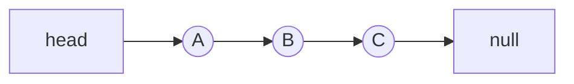
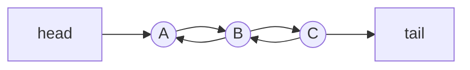
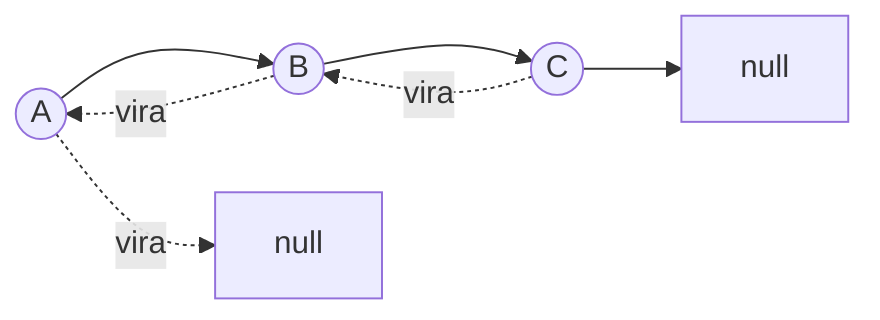

[Anterior](arrays-and-strings.md) | [Índice](../../SUMMARY.md) | [Próximo](stacks-and-queues.md)

# Listas Encadeadas — Técnicas e Algoritmos (Nível Sênior)

## Visão Geral e Contexto de Mercado

Listas encadeadas aparecem menos em código de aplicação moderno (por causa de locality/GC), mas são essenciais para:

- Entender estruturas compostas (hash table com chaining, filas, LRU, grafos com adjacency via nós).
- Resolver problemas clássicos (reversão, detecção de ciclo, merge de listas ordenadas).
- Reconhecer quando **não** usar: arrays costumam ser melhores para leitura sequencial e acesso por índice.

---

## Fundamentos, Evolução e Padrões de Mercado

- **Tipos**
	- Singly linked list (próximo)
	- Doubly linked list (anterior/próximo) — base de LRU clássico
	- Circular linked list

- **Operações e complexidade**
	- Inserção/remoção no início: $O(1)$
	- Inserção/remoção no meio: $O(1)$ depois que você tem o nó, mas achar o nó é $O(n)$
	- Acesso por índice: $O(n)$

---

## Diagramas e Intuição Visual

### Estrutura de nós (singly vs doubly)





### Reversão (ideia)



## Principais Desafios no Uso Profissional

- **Ponteiros/refs nulos** e bugs de manipulação.
- **Custo de alocação** e GC (cada nó é um objeto).
- Dificuldade de debugar estruturas longas em produção.

---

## Algoritmos Essenciais

### 1) Reversão de lista (iterativa)

**Complexidade:** $O(n)$ tempo, $O(1)$ espaço

### 2) Detecção de ciclo (Floyd: slow/fast)

**Complexidade:** $O(n)$ tempo, $O(1)$ espaço

### 3) Encontrar o meio (slow/fast)

Útil para merge sort em lista encadeada ou dividir listas.

---

## Exemplos Avançados (Python, C# e Go)

### Python — inverter lista encadeada

```python
from __future__ import annotations
from dataclasses import dataclass


@dataclass
class Node:
	val: int
	next: Node | None = None


def reverse(head: Node | None) -> Node | None:
	prev = None
	cur = head
	while cur is not None:
		nxt = cur.next
		cur.next = prev
		prev = cur
		cur = nxt
	return prev
```

### C# — detecção de ciclo (Floyd)

```csharp
public sealed class Node
{
	public int Value { get; }
	public Node? Next { get; set; }
	public Node(int value) => Value = value;
}

public static class LinkedListAlgorithms
{
	public static bool HasCycle(Node? head)
	{
		Node? slow = head;
		Node? fast = head;
		while (fast != null && fast.Next != null)
		{
			slow = slow!.Next;
			fast = fast.Next.Next;
			if (slow == fast) return true;
		}
		return false;
	}
}
```

### Go — achar o meio (slow/fast)

```go
type Node struct {
	Val  int
	Next *Node
}

func Middle(head *Node) *Node {
	slow, fast := head, head
	for fast != nil && fast.Next != nil {
		slow = slow.Next
		fast = fast.Next.Next
	}
	return slow
}
```

---

## Boas Práticas Sêniores e Armadilhas

- Em aplicações, prefira `deque`/`slice`/coleções padrão e use listas encadeadas apenas quando **o perfil justificar**.
- Em caches LRU, cuidado com concorrência: lista duplamente encadeada + map exige travas ou design lock-free.
- Valide invariantes com testes: nenhum nó perdido, nenhuma auto-referência inesperada.

---

## Integração na Arquitetura Real

- **LRU cache**: `map<key, node>` + doubly linked list para mover para a frente em $O(1)$.
- **Filas internas**: listas podem aparecer por baixo de abstrações.

---

## FAQ Especialista

**Por que listas encadeadas são raras em código de produto?**  
Porque arrays e estruturas contíguas ganham em cache locality e têm menos overhead de objetos.

**Quando elas ainda fazem sentido?**  
Quando você precisa de remoção/inserção frequente no meio e já tem referência direta ao nó (ex.: LRU), ou quando a biblioteca já entrega pronto.

[Anterior](arrays-and-strings.md) | [Índice](../../SUMMARY.md) | [Próximo](stacks-and-queues.md)
