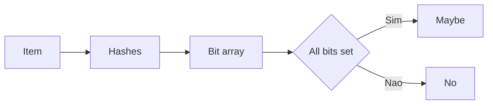

[Anterior](consistent-hashing-and-sharding.md) | [Índice](../../SUMMARY.md) | [Próximo](storage-indexes-btree-lsm-inverted.md)

# Probabilistic Data Structures — Bloom Filter, Sketches e HLL

## Visao Geral e Contexto de Mercado

Quando dados ficam gigantes, estruturas exatas (set, map) custam memoria e IO.
Estruturas probabilisticas aceitam um pequeno erro para ganhar:

- Menos memoria
- Menos roundtrip ao storage
- Melhor throughput

Elas sao comuns em:

- Deduplicacao e idempotencia em pipelines
- Evitar reads desnecessarios em bancos e caches
- Observabilidade e analytics (contagem de unicos, top items)

---

## Fundamentos, Evolucao e Padroes de Mercado

- **Bloom filter**
	- Responde "talvez contem" ou "com certeza nao contem".
	- Pode ter false positive, nao tem false negative.

- **Counting bloom**
	- Permite deletar, usando contadores em vez de bits.

- **Count min sketch**
	- Aproxima frequencia de items em streaming.
	- Bom para heavy hitters e ranking aproximado.

- **HyperLogLog**
	- Aproxima numero de unicos.
	- Muito usado em metricas e analytics.

---

## Diagramas e Intuicao Visual

### Bloom filter



---

## Principais Desafios no Uso Profissional

- **Erros e parametros**
	Escolher tamanho e numero de hashes decide o custo e o erro.

- **Ataques e skew**
	Entradas adversariais podem piorar distribuicao de hash.

- **Operacao e reset**
	Bloom filter cresce em false positive ao longo do tempo.

---

## Estrategias Avancadas e Decisoes Arquiteturais

- Use bloom filter na frente de um storage caro, para cortar misses.
- Use sketch para metricas onde aproximacao e aceitavel.
- Coloque expiracao ou rotacao de estruturas (janela de tempo).

---

## Exemplos Avancados (Python, C# e Go)

### Python — bloom filter simples

```python
import hashlib

class Bloom:
	def __init__(self, m: int, k: int):
		self.m = m
		self.k = k
		self.bits = bytearray((m + 7) // 8)

	def _set_bit(self, i: int) -> None:
		self.bits[i >> 3] |= 1 << (i & 7)

	def _get_bit(self, i: int) -> int:
		return (self.bits[i >> 3] >> (i & 7)) & 1

	def _hashes(self, s: str):
		h = hashlib.sha256(s.encode("utf-8")).digest()
		base1 = int.from_bytes(h[:8], "big")
		base2 = int.from_bytes(h[8:16], "big")
		for i in range(self.k):
			y = (base1 + i * base2) % self.m
			yield y

	def add(self, s: str) -> None:
		for i in self._hashes(s):
			self._set_bit(i)

	def maybe_contains(self, s: str) -> bool:
		for i in self._hashes(s):
			if self._get_bit(i) == 0:
				return False
		return True
```

---

## Boas Praticas Seniores e Armadilhas

- Nao use aproximacao quando precisa de corretude total.
- Monitore taxa de false positive e planeje rotacao.
- Prefira bibliotecas maduras para HLL e sketches em producao.

[Anterior](consistent-hashing-and-sharding.md) | [Índice](../../SUMMARY.md) | [Próximo](storage-indexes-btree-lsm-inverted.md)
