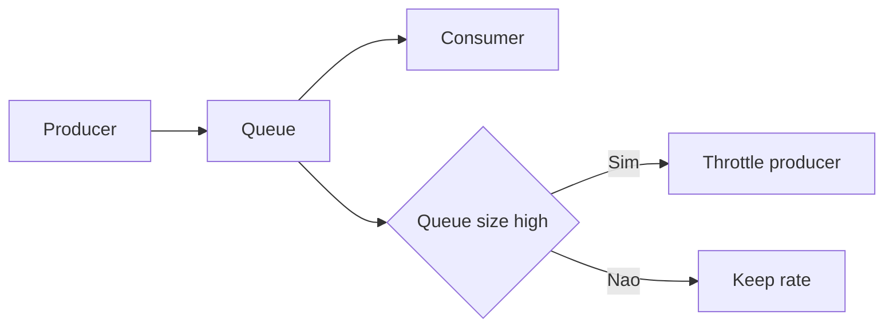

[Anterior](storage-indexes-btree-lsm-inverted.md) | [Índice](../../SUMMARY.md) | [Próximo](rate-limiting-algorithms-and-data-structures.md)

# Queues no Mundo Real — Ring Buffer, Priority Queue e Backpressure

## Visao Geral e Contexto de Mercado

Filas aparecem em:

- Workers e job processing
- Streaming e pipelines
- Rate limiting e controle de carga
- Sistemas orientados a eventos

Na pratica, a estrutura correta ajuda a manter latencia estavel e evitar estouro de memoria.

---

## Fundamentos, Evolucao e Padroes de Mercado

- **Ring buffer**
	- Estrutura circular com head e tail.
	- Muito eficiente para buffers e filas em memoria.

- **Priority queue**
	- Itens com prioridade: scheduling, rate limiting, retries.

- **Delay queue**
	- Item fica disponivel apenas depois de um timestamp.
	- Muito usada para retry com backoff.

- **Backpressure**
	- Mecanismo para desacelerar produtores quando consumidores estao atras.

---

## Diagramas e Intuicao Visual

### Backpressure



---

## Principais Desafios no Uso Profissional

- **Unbounded queue**
	Fila sem limite vira incidente.

- **Poison messages**
	Mensagens que sempre falham causam loop de retry.

- **Ordem vs throughput**
	Garantir ordering pode limitar paralelismo.

---

## Estrategias Avancadas e Decisoes Arquiteturais

- Defina limites e politicas: drop, block, spill to disk.
- Use DLQ para poison messages.
- Para retries, use delay queue com jitter e max attempts.

---

## Exemplos Avancados (Python, C# e Go)

### Go — ring buffer basico

```go
package ring

type Ring[T any] struct {
	buf []T
	head int
	tail int
	size int
}

func New[T any](cap int) *Ring[T] {
	return &Ring[T]{buf: make([]T, cap)}
}

func (r *Ring[T]) Push(v T) bool {
	if r.size == len(r.buf) {
		return false
	}
	r.buf[r.tail] = v
	r.tail = (r.tail + 1) % len(r.buf)
	r.size++
	return true
}

func (r *Ring[T]) Pop() (T, bool) {
	var zero T
	if r.size == 0 {
		return zero, false
	}
	v := r.buf[r.head]
	r.head = (r.head + 1) % len(r.buf)
	r.size--
	return v, true
}
```

---

## Boas Praticas Seniores e Armadilhas

- Sempre tenha estrategia para overload.
- Meça queue depth e lag.
- Evite retries infinitos.

[Anterior](storage-indexes-btree-lsm-inverted.md) | [Índice](../../SUMMARY.md) | [Próximo](rate-limiting-algorithms-and-data-structures.md)
