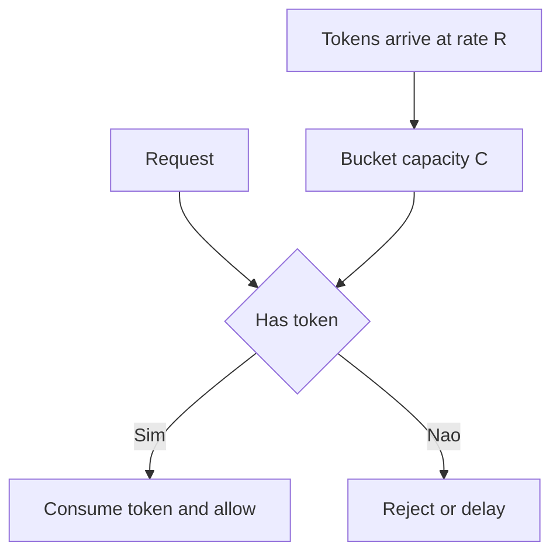
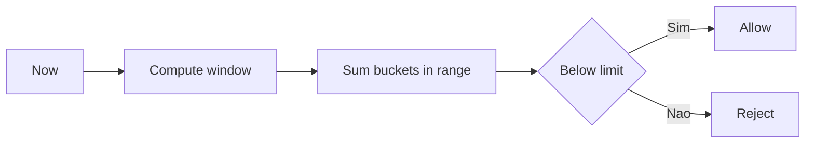

[Anterior](queues-ring-buffer-backpressure.md) | [Índice](../../SUMMARY.md) | [Próximo](vector-search-ann.md)

# Rate Limiting — Token Bucket, Leaky Bucket e Sliding Window

## Visao Geral e Contexto de Mercado

Rate limiting protege sistemas de:

- Picos de trafego e overload
- Abuso (bots, scraping)
- Cascata de falhas (downstream lento)

Em backends modernos, ele aparece em:

- API gateways
- BFF e edge services
- Sistemas internos para proteger dependencias

O ponto senior: rate limiting e um problema de **estrutura de dados + consistencia + observabilidade**.

---

## Fundamentos, Evolucao e Padroes de Mercado

### Modelos comuns

- **Fixed window counter**
	- Conta requests por janela (ex.: 60s).
	- Simples, mas tem "boundary burst".

- **Sliding window log**
	- Guarda timestamps de requests e remove os antigos.
	- Preciso, mas caro (memoria e IO).

- **Sliding window counter**
	- Aproxima usando buckets (ex.: por segundo) e soma parcial.
	- Bom trade off em producao.

- **Token bucket**
	- Tokens chegam a uma taxa; cada request consome 1 token.
	- Permite burst controlado.

- **Leaky bucket**
	- "Vaza" a uma taxa constante.
	- Bom para suavizar trafego (shape), parecido com fila.

---

## Diagramas e Intuicao Visual

### Token bucket



### Sliding window counter por buckets



---

## Principais Desafios no Uso Profissional

- **Distribuido**
	Em varias instancias, contadores locais nao funcionam para limite global.

- **Clock skew e tempo**
	Sliding window depende de tempo consistente.

- **Hot keys**
	Um usuario ou endpoint pode dominar e causar contenção.

- **Justica e priorizacao**
	Cliente com mais retry pode "ganhar" mais slots se nao houver controle.

---

## Estrategias Avancadas e Decisoes Arquiteturais

- **Escolha do escopo**
	- Por user id
	- Por ip
	- Por api key
	- Por endpoint
	- Por tenant

- **Global vs local**
	- Local (por instancia) e simples e reduz latencia.
	- Global precisa de coordenação (ex.: Redis) ou aproximacao.

- **Redis atomic**
	- Use comandos atomicos ou Lua para manter corretude.
	- Evite race conditions em contadores.

- **Backoff e retry**
	- Retorne 429 e headers.
	- Use jitter e exponencial backoff no cliente.

- **Observabilidade**
	- Meça allow rate, reject rate, p95/p99, e top keys.

---

## Exemplos Avancados (Python, C# e Go)

### Python — token bucket por chave

```python
import time

class TokenBucket:
	def __init__(self, rate_per_sec: float, capacity: float):
		self.rate = rate_per_sec
		self.cap = capacity
		self.tokens = capacity
		self.last = time.time()

	def allow(self, cost: float = 1.0) -> bool:
		now = time.time()
		dt = now - self.last
		self.last = now
		self.tokens = min(self.cap, self.tokens + dt * self.rate)
		if self.tokens >= cost:
			self.tokens -= cost
			return True
		return False

# usage: map key -> bucket
```

### C# — fixed window counter (idea)

```csharp
using System;
using System.Collections.Concurrent;

public sealed class FixedWindowLimiter
{
	private readonly int _limit;
	private readonly TimeSpan _window;
	private readonly ConcurrentDictionary<string, (long windowId, int count)> _state = new();

	public FixedWindowLimiter(int limit, TimeSpan window)
	{
		_limit = limit;
		_window = window;
	}

	public bool Allow(string key)
	{
		long nowTicks = DateTimeOffset.UtcNow.ToUnixTimeMilliseconds();
		long windowId = nowTicks / (long)_window.TotalMilliseconds;

		while (true)
		{
			var cur = _state.GetOrAdd(key, _ => (windowId, 0));
			if (cur.windowId != windowId)
			{
				if (_state.TryUpdate(key, (windowId, 1), cur)) return true;
				continue;
			}
			if (cur.count >= _limit) return false;
			if (_state.TryUpdate(key, (windowId, cur.count + 1), cur)) return true;
		}
	}
}
```

### Go — bucketed sliding window (estrutura)

```go
package limiter

import "time"

type Bucket struct {
	Start int64
	Count int
}

type SlidingCounter struct {
	WindowMs int64
	StepMs   int64
	Limit    int
	Buckets  []Bucket
}

func (s *SlidingCounter) Allow(now time.Time) bool {
	nowMs := now.UnixMilli()
	cut := nowMs - s.WindowMs

	// drop outdated buckets
	kept := s.Buckets[:0]
	sum := 0
	for _, b := range s.Buckets {
		if b.Start >= cut {
			kept = append(kept, b)
			sum += b.Count
		}
	}
	s.Buckets = kept
	if sum >= s.Limit {
		return false
	}

	// add to current step bucket
	stepStart := nowMs - (nowMs % s.StepMs)
	if len(s.Buckets) > 0 && s.Buckets[len(s.Buckets)-1].Start == stepStart {
		s.Buckets[len(s.Buckets)-1].Count++
	} else {
		s.Buckets = append(s.Buckets, Bucket{Start: stepStart, Count: 1})
	}
	return true
}
```

---

## Boas Praticas Seniores e Armadilhas

- Nao confunda rate limiting com backpressure: ambos se complementam.
- Sempre retorne sinal claro para o cliente (429, headers, retry after).
- Para limite global, prefira storage com operacoes atomicas.
- Para alto volume, use aproximacao (bucketed counter) em vez de log exato.

[Anterior](queues-ring-buffer-backpressure.md) | [Índice](../../SUMMARY.md) | [Próximo](vector-search-ann.md)
