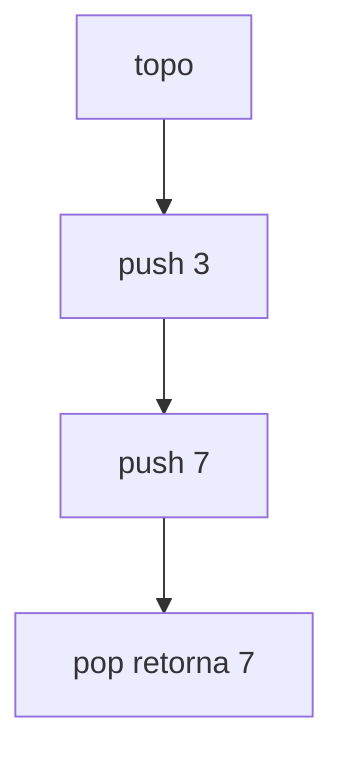
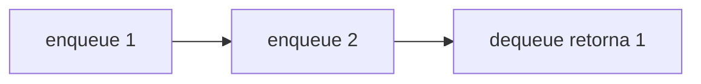
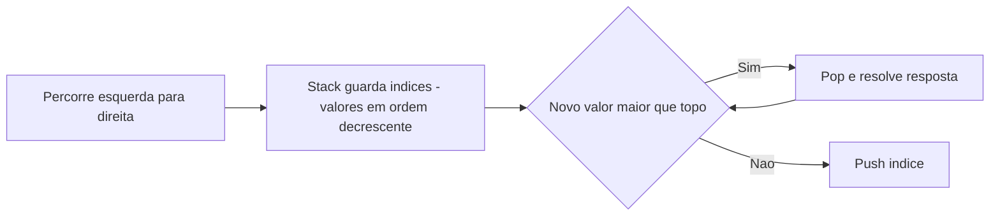

[Anterior](linked-lists.md) | [Índice](../../SUMMARY.md) | [Próximo](hash-tables-and-sets.md)

# Stacks & Queues — Parsing, BFS e Monotonic Stack

## Visão Geral e Contexto de Mercado

Pilhas e filas aparecem em:

- Parsing (JSON, expressões, validação de parênteses)
- Execução de workflows (fila de jobs)
- Grafos (BFS com fila; DFS com pilha)
- Problemas de “próximo maior/menor” (monotonic stack)

---

## Fundamentos, Evolução e Padrões de Mercado

- **Stack (LIFO)**
	- `push/pop` em $O(1)$

- **Queue (FIFO)**
	- `enqueue/dequeue` em $O(1)$
	- Implementação prática: `deque`/ring buffer (evite “fila” com array que dá `shift` $O(n)$)

- **Deque**
	- Remove/adiciona em ambas pontas; excelente para janelas e monotonic queue.

---

## Diagramas e Intuição Visual

### Stack (LIFO)



### Queue (FIFO)



### Monotonic Stack (próximo maior)



## Algoritmos Essenciais

### 1) Monotonic Stack

Resolve “próximo maior elemento”/“área máxima em histograma”/“temperaturas diárias”.

**Complexidade:** $O(n)$ (cada elemento entra e sai no máximo uma vez)

### 2) BFS (fila)

Camadas, menor número de arestas em grafo não ponderado, flood fill.

**Complexidade:** $O(V+E)$

---

## Exemplos Avançados (Python, C# e Go)

### Python — validação de parênteses (stack)

```python
def is_valid_parentheses(s: str) -> bool:
	pairs = {')': '(', ']': '[', '}': '{'}
	stack: list[str] = []
	for ch in s:
		if ch in pairs.values():
			stack.append(ch)
		elif ch in pairs:
			if not stack or stack.pop() != pairs[ch]:
				return False
		else:
			return False
	return not stack
```

### C# — fila eficiente com `Queue<T>` (BFS em grid)

```csharp
using System.Collections.Generic;

public static class BfsGrid
{
	public static int ShortestPath4Dir(int[,] grid, (int r, int c) start, (int r, int c) goal)
	{
		int rows = grid.GetLength(0);
		int cols = grid.GetLength(1);
		var dist = new int[rows, cols];
		for (int r = 0; r < rows; r++)
			for (int c = 0; c < cols; c++) dist[r, c] = -1;

		var q = new Queue<(int r, int c)>();
		q.Enqueue(start);
		dist[start.r, start.c] = 0;

		int[] dr = { -1, 1, 0, 0 };
		int[] dc = { 0, 0, -1, 1 };

		while (q.Count > 0)
		{
			var (r, c) = q.Dequeue();
			if ((r, c) == goal) return dist[r, c];
			for (int k = 0; k < 4; k++)
			{
				int nr = r + dr[k], nc = c + dc[k];
				if (nr < 0 || nr >= rows || nc < 0 || nc >= cols) continue;
				if (grid[nr, nc] == 1) continue; // 1 = bloqueado
				if (dist[nr, nc] != -1) continue;
				dist[nr, nc] = dist[r, c] + 1;
				q.Enqueue((nr, nc));
			}
		}
		return -1;
	}
}
```

### Go — monotonic stack para próximo maior elemento

```go
func NextGreater(nums []int) []int {
	res := make([]int, len(nums))
	for i := range res {
		res[i] = -1
	}
	stack := make([]int, 0) // guarda índices
	for i, x := range nums {
		for len(stack) > 0 && nums[stack[len(stack)-1]] < x {
			j := stack[len(stack)-1]
			stack = stack[:len(stack)-1]
			res[j] = x
		}
		stack = append(stack, i)
	}
	return res
}
```

---

## Boas Práticas Sêniores e Armadilhas

- Use `deque`/ring buffer para filas; evite remover do início de arrays.
- Monotonic stack/queue são “amortizados” $O(n)$ — explique isso em code review.
- Em BFS grande, monitore memória: a fila pode crescer muito em picos.

---

## Integração na Arquitetura Real

- **Filas internas vs broker**: fila in-memory é ótima para desacoplamento local, mas não substitui persistência e retry.
- **Parsing**: stacks aparecem em validação de payloads, logs e AST.

[Anterior](linked-lists.md) | [Índice](../../SUMMARY.md) | [Próximo](hash-tables-and-sets.md)
