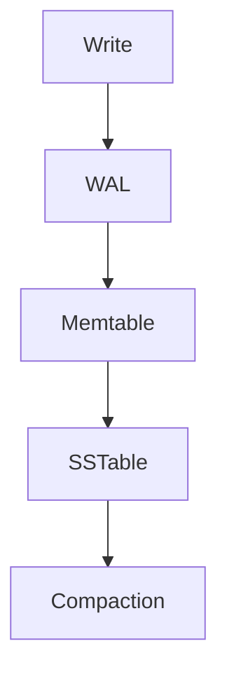

[Anterior](probabilistic-data-structures.md) | [Índice](../../SUMMARY.md) | [Próximo](queues-ring-buffer-backpressure.md)

# Storage Indexes — B Tree, LSM Tree e Inverted Index

## Visao Geral e Contexto de Mercado

Muita decisao de arquitetura depende das estruturas internas do storage.
Entender B Tree, LSM e inverted index ajuda em:

- Escolher banco certo para workload
- Explicar latencia em p95 e p99
- Projetar indices e queries
- System design interviews

---

## Fundamentos, Evolucao e Padroes de Mercado

- **B Tree e B Plus Tree**
	- Otimizadas para disco e page cache.
	- Boa para reads e range scans.
	- Muito usada em bancos relacionais e KV.

- **LSM Tree**
	- Otimiza escrita: write ahead log, memtable, sstables.
	- Compaction reorganiza dados ao longo do tempo.
	- Muito usada em bancos distribuido e KV modernos.

- **Inverted index**
	- Base de search.
	- Mapeia termo para lista de documentos.
	- Combinado com ranking e scoring.

---

## Diagramas e Intuicao Visual

### LSM em alto nivel



### Inverted index


---

## Principais Desafios no Uso Profissional

- **Write amplification**
	Compaction pode aumentar IO e custo.

- **Tuning por workload**
	Reads aleatorios, range scans e writes tem trade offs.

- **Indices demais**
	Aceleram leitura, mas encarecem escrita.

---

## Estrategias Avancadas e Decisoes Arquiteturais

- Planeje indices pelo caminho critico de leitura.
- Para LSM, monitore compaction e IO, e ajuste tiers.
- Para search, entenda custo de postings e filtros.

---

## Exemplos Avancados (Python, C# e Go)

### Pseudocodigo — leitura em LSM

```text
read(key)
  if memtable has key return value
  for each sstable in newest to oldest
    if sstable bloom says no continue
    lookup in sstable index
    if found return value
  return not found
```

---

## Boas Praticas Seniores e Armadilhas

- Range queries sao naturais em B tree, mas podem ser caras em LSM.
- Use bloom filters em LSM para reduzir IO.
- Indice e um produto: meca beneficio e custo.

[Anterior](probabilistic-data-structures.md) | [Índice](../../SUMMARY.md) | [Próximo](queues-ring-buffer-backpressure.md)
