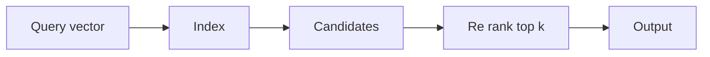

[Anterior](rate-limiting-algorithms-and-data-structures.md) | [Índice](../../SUMMARY.md) | [Próximo](../complexity/code-quality-and-complexity-metrics.md)

# Vector Search — ANN, HNSW e IVF (Relevancia Atual)

## Visao Geral e Contexto de Mercado

Busca vetorial ganhou espaco com recomendacao, dedup semantico e RAG.
O problema e encontrar vizinhos mais proximos em alta dimensao.

- Baseline exato e caro: custo cresce com numero de vetores
- ANN troca um pouco de recall por latencia baixa

---

## Fundamentos, Evolucao e Padroes de Mercado

- **Brute force**
	- Calcula distancia para todos e pega top k.
	- Bom como baseline e para datasets pequenos.

- **IVF**
	- Clusteriza vetores e busca apenas em alguns clusters.
	- Reduz candidatos.

- **HNSW**
	- Grafo de navegacao em camadas.
	- Busca faz greedy walk e explora vizinhos.

- **Trade offs comuns**
	- Recall vs latencia
	- Memoria do indice vs custo de build
	- Atualizacao online vs rebuild

---

## Diagramas e Intuicao Visual

### ANN em alto nivel



---

## Principais Desafios no Uso Profissional

- **Qualidade**
	Medir recall real por segmento de trafego.

- **Atualizacao**
	Insercao em tempo real pode ser dificil dependendo do indice.

- **Custos**
	Indice pode ser grande; planeje memoria e persistencia.

---

## Estrategias Avancadas e Decisoes Arquiteturais

- Sempre mantenha um baseline exato para validacao offline.
- Separe retrieval e rerank.
- Monitore latencia e recall por versao de embedding.

---

## Exemplos Avancados (Python, C# e Go)

### Python — baseline brute force

```python
import math

def cosine(a, b):
	dot = 0.0
	n1 = 0.0
	n2 = 0.0
	for x, y in zip(a, b):
		dot += x * y
		n1 += x * x
		n2 += y * y
	if n1 == 0.0 or n2 == 0.0:
		return 0.0
	return dot / (math.sqrt(n1) * math.sqrt(n2))

def topk(query, vectors, k):
	scored = []
	for idx, v in enumerate(vectors):
		scored.append((cosine(query, v), idx))
	scored.sort(reverse=True)
	return scored[:k]
```

---

## Boas Praticas Seniores e Armadilhas

- Nao trate ANN como caixa preta: valide recall e drift.
- Faca A B testing de embedding e indice.
- Tenha plano de rebuild do indice.

[Anterior](rate-limiting-algorithms-and-data-structures.md) | [Índice](../../SUMMARY.md) | [Próximo](../complexity/code-quality-and-complexity-metrics.md)
